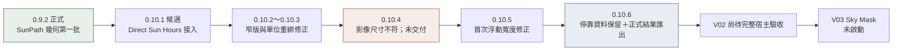
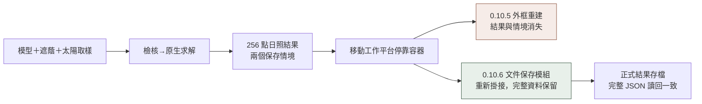
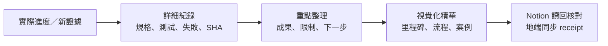

# 開發過程 · 視覺化精華

更新：2026-10-03。有實際進度才更新本頁與 Notion 固定 KB-003；本頁是精華，原始證據由 [詳細驗證](HOME_VALIDATION_0106.md) 與 [知識索引](KNOWLEDGE_INDEX.md) 追溯。

| 正式可用基準 | 本輪候選 | 下一功能 |
| --- | --- | --- |
| 0.9.2；9 獨立／1 後端／112 待接入 | 0.10.6；日照候選與平台資料保留修正；10／1／111 | V02 剩餘驗收→LB-067 Sky Mask→LB-068 Solar Envelope |

## 里程碑

## 這次使用流程改進

## 真實日照案例

| 情境 | 取樣點數 | 平均日照 | 原生結果 |
| --- | ---: | ---: | --- |
| 無遮蔭基準 | 256 | 13 h | 每點可見 13 個逐時太陽取樣 |
| 新增遮蔭 | 256 | 9.57421875 h | 最小 8 h、最大 13 h |

自建隔離模型；算術點平均，非面積加權。13 個含首尾的取樣不代表 13 小時曆時長度，不是採光照度或法規判定。模型／遮蔭條件不同，指紋與輸入保留於完整 JSON。

## 驗證與下一步

| 層級 | 本輪完成 | 尚待完成 |
| --- | --- | --- |
| 建置／工具 | Build 0／0；Core 25；MCP 工具 12 | 遠端上傳與跨機試用 |
| 求解／平台 | 161 既有回歸；33 狀態／文件隔離 | 大型複雜模型與多視窗文件 UI |
| 原生操作 | Picker 預選 2；結果匯出／比較取消 3 | 滑鼠後選；比較成功存檔 |
| 視覺 | 前輪淺色影像保留，本輪未重拍 | 完整 Dock 窄／寬、深色、完整鍵盤 |

不提供無驗收依據的整體完成百分比。199 項檢查不等於 199 個功能；正式覆蓋保持 9／1／112。
