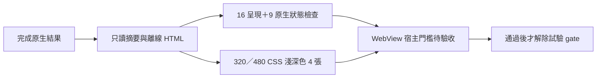
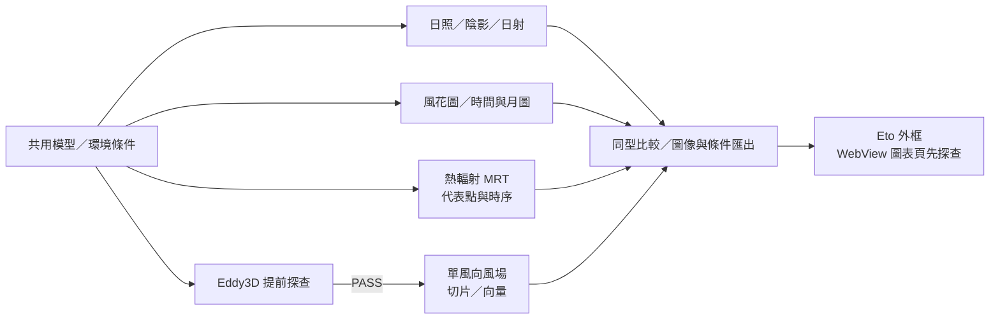
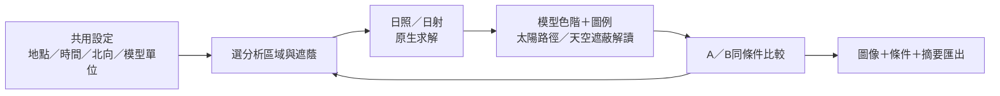
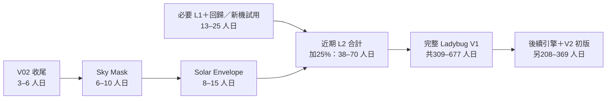
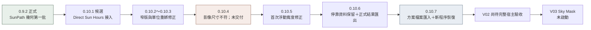
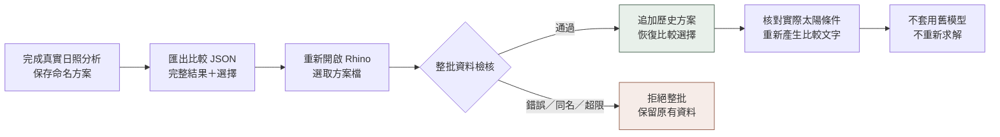
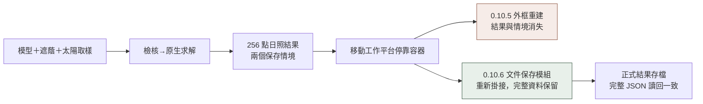
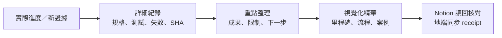

## 2026-10-08 · 圖像知識與 Git 交接

補附 0.10.9 日照 HTML 成果與 0.9.2 Rhino SunPath 兩張實際圖片到固定 Notion KB-003；各自標明原始日期、來源與驗證範圍，已讀回圖片區塊。專案卡片與 KB-001 同步知識入口，MCP AI 首頁維持多專案導航。Git 交接使用 `codex/company-0109-knowledge-20261008`；只替換遠端 `EnvironmentalSimulationHub/`，成功以遠端子樹核對與本機具名回執為準。

[本輪知識與家用接續](KNOWLEDGE_GIT_UPDATE_2026-10-08.md) · [圖片上傳／讀回回執](evidence/knowledge_20261008/notion_image_receipt.json)。沒有新增 Build、求解、部署或覆蓋變更：正式 0.9.2／9、1、112；已部署候選 0.10.9／10、1、111。主線仍為指定時刻陰影、風花圖／常用圖表、MRT 與提前 Eddy3D 引擎關卡。

## 2026-10-05 · 公司已部署 0.10.9／重複 ID 修正

公司新專用 Rhino 已實際載入 **0.10.9.0**。修正 HKLM／HKCU 兩筆既有外掛路徑，消除舊 0.10.1 覆蓋與再次載入同 ID 的觸發原因；保留 GUID、舊版及第一份備份。15 項原生檢查通過，包含兩次新日照求解（256 點無遮蔭 13 h、遮蔭 8–13 h／平均 9.57421875 h）、A/B、新版 HTML、失敗保留、模組切換與實際停靠／浮動狀態。另有本輪 42 方案、15 MCP 工具檢查。

新版報告頁由「匯出圖像摘要 HTML…」使用，WebView 預設 gate 保留。原生窄版擷取未通過宿主型別假設，完整 Dock 版面／主題／DPI／鍵盤與檔案對話框仍待驗收；MCP 曾提前斷線，後續同程序版本及原生紀錄已讀回。有效測試物件清空，面板已關閉；未強制結束工作階段。

[部署、操作與回復](COMPANY_DEPLOYMENT_0109.md) · [最終證據](evidence/deploy_0109/deployment_verified.json) · [本輪真實日照摘要](evidence/deploy_0109/current-summary.html)。正式功能基準 **0.9.2／9、1、112**；已部署候選 **0.10.9／10、1、111**，不增加功能覆蓋。本輪沒有 GitHub 推送或跨機試用驗收。下一步維持指定時刻陰影、風花圖／常用圖表及提前 Eddy3D 引擎關卡。

## 2026-10-05 · 0.10.9 日照成果頁視覺優化

候選來源 **0.10.9** 採建築成果報告版面：大型平均日照、分布圖與條件分欄、主題色／線條圖示、可展開數據與來源、首尾取樣日期。320–1280px 淺深色共 10 組尺寸／展開檢查通過；18 項呈現契約與 Release Build 0 錯誤／0 警告。已人工檢視 10 張收合及 2 張展開圖；資料為歷史原生結果，本輪沒有新求解。

[成果頁與 Audit／驗證範圍](VISUAL_RESULT_PAGE_0109.md) · [淺色預覽](evidence/visual_0109/summary-light.html) · [證據](evidence/visual_0109/acceptance.json)。Core／Adapters／Grasshopper 與單一工作區保持原行為。WebView 預設試驗 gate 保留；完整 Rhino Dock／原生主題、鍵盤與失敗復原待驗收，未部署。正式 0.9.2／9、1、112，候選 10、1、111，不增加功能覆蓋。

## 2026-10-05 · 0.10.8 日照圖像摘要與 WebView 探查

候選來源 0.10.8 新增中文日照分布圖、原生色樣、KPI／來源／目標／比較摘要與離線 HTML 匯出。只讀 WebView 在同一內部視圖惰性載入，預設由試驗 gate 阻擋初始化；C# 權威狀態與求解核心保留。

最終 Build 0 錯誤／0 警告；呈現契約 16、原有方案契約 42、隔離 Rhino 呈現／狀態 9 項通過，修正版 WebView 中文 DOM 已讀回。真正 320／480 CSS viewport 淺／深色四張已檢視，無水平溢出。這是歷史原生結果的呈現驗證，沒有本輪新求解。

原生 SDK 擷取、完整 Dock／原生深色／DPI／鍵盤／檔案及非同步失敗復原待驗收；MV-U0 部分完成。公司自建 Rhino 自動載入舊 0.10.1，探查改用獨立組件名稱，未替換公司註冊或正式部署。正式仍 0.9.2／9、1、112；候選 10、1、111，UI 工作不增加功能覆蓋。

[詳細驗證與下一步](WEBVIEW_RESULT_PROBE_0108.md) · [證據](evidence/webview_0108/acceptance.json) · [離線摘要](evidence/webview_0108/summary-light.html)。本輪失敗與限制另存；其他專案未修改，GitHub 未推送。

## 2026-10-05 · 目前採用：多功能視覺化 MVP

依使用者最新指示，主線改為 **日照／日射 → 指定時刻陰影 → 風花圖與常用圖表 → 熱輻射 MRT**；Eddy3D 單風向風模擬提前做引擎／基準探查，PASS 後插入風場實作，不再等待完整 Ladybug。先交付多種可解讀、可比較、可匯出的最小流程；細部數值工具、全參數、Solar Envelope 與全量獨立頁後排，必要資料／單位與原生數值驗證仍保留。

[多功能 MVP 活動計畫](MULTI_VISUAL_MVP_PLAN_2026-10-05.md)取代前版日照單線排序及其近期工期。核心 MVP 含風引擎探查、不含風場實作：48–85 人日；含通過探查後的風場實作：63–113 人日，皆只加一次 25% 預備量，單人＋AI 全時工程假設，非交付日期。未通過風場關卡的釋出須明示風場未交付。

本輪只調整計畫與知識文件。正式 0.9.2／9、1、112、候選 0.10.7／10、1、111 不變；公司 Rhino 載入／完整 UI 待驗收，沒有新增求解或功能覆蓋。前版規劃與驗證保留原範圍。

參考「Rhino MCP UIUX」後，加入 [Eto 外框＋WebView 圖表／成果探查](WEBVIEW_UI_STRATEGY_2026-10-05.md)：先只讀圖表／圖例／比較頁，保留 C# 狀態、原生選取與既有求解。公司 SDK 有 WebView API／組件，宿主初始化／Dock 尚未驗證；MV-U0 條件式探查 2–4 原始人日，含一次 25% 為 3–5 人日，不含全介面遷移。

## 2026-10-05 · 公司接續已就緒

家用 0.10.7 來源與 8 個提交已同步到公司，完整專案樹相同；公司建置 0 錯誤／0 警告，25 Core＋42 方案契約＋3 證據完整性檢查通過。公司 Rhino 載入及完整 UI 尚待驗收，正式功能數不變。原公司來源已有保留分支，未修改其他專案。[同步紀錄](COMPANY_SYNC_2026-10-05.md)。

## 歷史計畫 · 2026-10-03 視覺優先與日照流程瘦身

交付改為完整日照設計流程：共用設定→模型結果→天空遮蔽解讀→A／B比較→精簡匯出。先A日照視覺MVP23–40人日／5–8工作週，再B Solar Envelope13–23人日／3–5工作週；A＋B統一加25%為35–63人日。單人＋AI全時工程假設；122能力保留待辦，CFD／全量獨立頁面／大框架重寫後排。正式0.9.2／候選0.10.7，未新增求解驗證。

[2026-10-03 日照計畫](OPTIMIZED_VISUAL_PLAN_2026-10-03.md)保留為歷史範圍；目前活動排序與工期以本文最上方 2026-10-05 多功能 MVP 計畫為準。

# 開發過程 · 視覺化精華

更新：2026-10-03。有實際進度才更新本頁與 Notion 固定 KB-003；本頁是精華，原始證據由 [詳細驗證](HOME_VALIDATION_0107.md) 與 [知識索引](KNOWLEDGE_INDEX.md) 追溯。

| 正式可用基準 | 本輪候選 | 下一功能 |
| --- | --- | --- |
| 0.9.2；9 獨立／1 後端／112 待接入 | 0.10.7；日照方案檔案恢復與比較檢核；10／1／111 | V02 剩餘驗收→LB-067 Sky Mask→LB-068 Solar Envelope |

## 技術與工期評估 · 2026-10-03

完整解讀見[技術評估](TECHNICAL_ASSESSMENT_2026-10-03.md)；數值是工作量假設，不是新增求解驗收。現有技術為C#／.NET 8、RhinoCommon／Eto、隔離Grasshopper與原生Ladybug；日射天空矩陣使用Radiance。瓶頸集中於完整宿主操作、同步求解、共用資料型別、大型模型與部署，另需.NET支援生命週期探查。

一位工程人員、AI輔助、全時投入；8小時人日、5日工作週、20日規劃月。近期約8–14工作週，完整Ladybug約16–34規劃月；後續引擎與V2信心低，逐批重估。近期是完整Ladybug的子集合，不能重複加總；未確定實際驗收時間，因此未承諾完工日期。112入口逐項人日、共用61–109人日及25%預備量見可重算模型。正式／候選覆蓋維持9／1／112及10／1／111。

## 里程碑

## 本輪使用流程

六個方案在新程序恢復，完整 NativeResult、中文名稱與選擇一致；所有恢復資料標示歷史來源。單一方案可匯出，最多 20 個方案、64 MiB。原生對話框選取／存檔仍待驗收，API 檔案往返已通過。

## 0.10.6 資料保留里程碑

## 真實日照案例

| 情境 | 取樣點數 | 平均日照 | 原生結果 |
| --- | ---: | ---: | --- |
| 無遮蔭基準 | 256 | 13 h | 每點可見 13 個逐時太陽取樣 |
| 新增遮蔭 | 256 | 9.57421875 h | 最小 8 h、最大 13 h |

自建隔離模型；算術點平均，非面積加權。13 個含首尾的取樣不代表 13 小時曆時長度，不是採光照度或法規判定。模型／遮蔭條件不同，指紋與輸入保留於完整 JSON。

## 驗證與下一步

| 層級 | 本輪完成 | 尚待完成 |
| --- | --- | --- |
| 建置／工具 | Build 0／0；Core 25；MCP 工具 12 | 遠端上傳與跨機試用 |
| 求解／平台 | 161 既有回歸；32 狀態／文件隔離 | 大型複雜模型與多視窗文件 UI |
| 方案恢復 | 42 契約、17 原生匯入、13 新程序恢復 | 原生檔案選取與比較成功存檔 |
| 視覺 | 新版 4 張 320／480 淺色離屏圖已檢視 | 完整 Dock 窄／寬、深色、完整鍵盤／滑鼠後選 |

測試工具曾用錯誤 API 造成自建 Rhino 退出；已保存 .NET 堆疊並修正，產品不使用該 API。失敗操作不列為已驗收。不提供無驗收依據的整體完成百分比；302 項檢查不等於 302 個功能，正式覆蓋保持 9／1／112。
