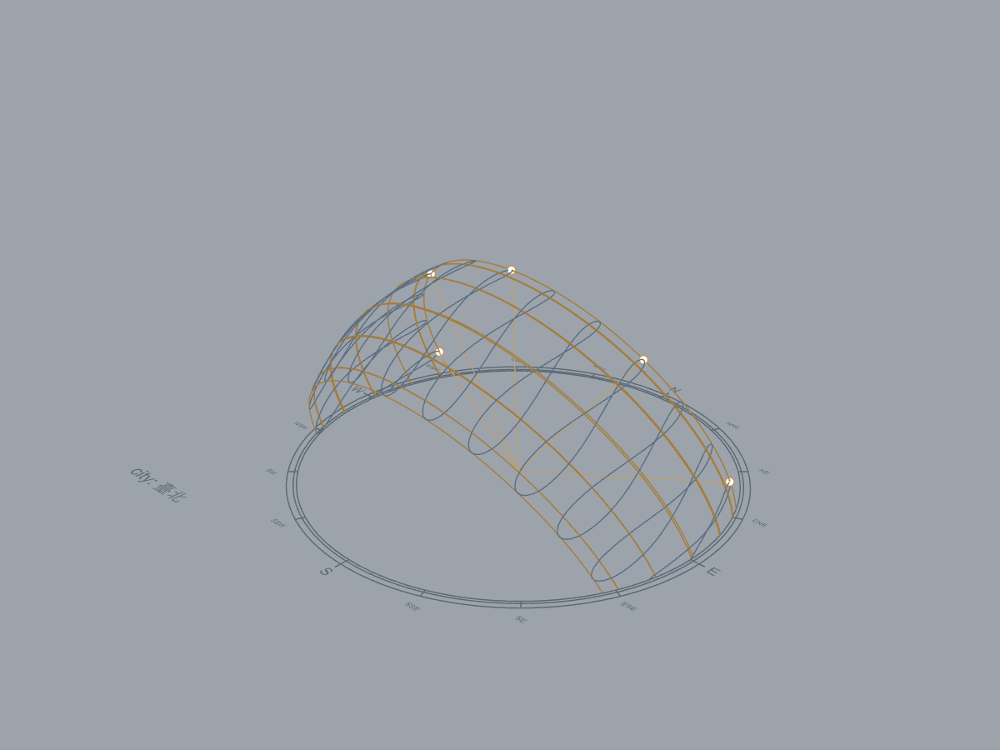

# 知識整理與 Git 交接｜2026-10-08

本輪整理已部署候選 0.10.9 的操作、成果、限制及專案限定 Git 交接。沒有新增 Build、求解、部署或功能驗收。正式基準 0.9.2（9 獨立／1 後端／112 待接入），候選 0.10.9（10／1／111）。

## 知識入口

- [專案卡片](https://app.notion.com/p/3f01956a9b0e81f0a52fc11e84c1d86c)：八個主題層級、主要操作與接續開發。
- [視覺化精華 KB-003](https://app.notion.com/p/3ee1956a9b0e8157996cd7e88c4d2cf3)：補附兩張實際圖片，已讀回原生圖片區塊與用途／日期／驗證範圍。
- [目前狀態 KB-001](https://app.notion.com/p/3ec1956a9b0e81aca858fefd1fae1c4c)：保持正式與候選覆蓋分開。
- [活動計畫](MULTI_VISUAL_MVP_PLAN_2026-10-05.md)：指定時刻陰影、風花圖／常用圖表、MRT；Eddy3D 引擎與基準探查提前。

沿用既有分類與固定紀錄。MCP AI 首頁保留多專案導航，本專案不加回長篇報告；舊 Environmental 資料仍在卡片的歷史子頁。知識更新日期不代表新的求解或部署日期。

## 圖像與原始證據

### 日照 HTML 成果頁 · 0.10.9／2026-10-05


1280px 淺色的實際 HTML 報告畫面，使用既有原生日照資料：256 格點、8–13 h、算術點平均 9.57421875 h。本輪重新檢視並補附原圖，不代表 2026-10-08 新求解或完整 Rhino Dock／DPI／鍵盤驗收。呈現範圍見 [0.10.9 視覺驗證](VISUAL_RESULT_PAGE_0109.md)。

### Rhino SunPath 視埠 · 0.9.2／2026-10-02 正式基準



實際 Rhino 視埠，保留原圖及 0.9.2 驗收範圍。不是合成模擬、0.10.9 新求解或 CFD 證據。原生驗收見 [正式載入證據](evidence/release_092_loaded.json)。

兩張圖片使用官方 Notion file upload，每個 URL 各一次 multipart POST，HTTP 200；已附於同一個 KB-003 並讀回。上傳 ID、來源、SHA-256、回應摘要與原生圖片 block ID 見 [本輪回執](evidence/knowledge_20261008/notion_image_receipt.json)。上傳網址與 headers 不納入 Git；不重複上傳已成功附圖的紀錄。

## Git 交接方法

個人目的地為 `ciszon21-commits/Main`。本機 EnvironmentalSimulationHub 是獨立 Git 根目錄，GitHub Main 是多專案根目錄，不可直接在本機專案 pull 整個 Main。

本輪交接分支：`codex/company-0109-knowledge-20261008`。以核對的遠端 main `e7744cea946fd5afe062c02c9a2dada0fa9c2b9f` 與家用 `codex/home-0102-validation`／`d6c12af56ae034bd080e8990ba7b69b5c50ba1da` 保留祖先，在專案隔離的 Git 物件庫準備目前來源快照，只替換 `EnvironmentalSimulationHub/` 子樹。發布前審查來源 HEAD／index 與可達歷史的排除項目、憑證特徵及 blob 大小。透過已連接的 GitHub 官方工具發布，無須另存 GitHub token、修改全域 Git 設定或登入不同帳號。

遠端成功以具名分支、提交、子樹 SHA 及本機 `transfer/github_publish_20261008.json` 回執為準；回執記錄原 main／家用分支與其他根目錄條目的 SHA 核對。發布不等於跨機／同仁 UI 驗收。本機獨立提交歷史保留；GitHub 交接提交以兩個既有遠端祖先與目前完整專案樹承接。

## 家用電腦接續

新目錄取得本輪分支：

```powershell
git clone --filter=blob:none --sparse --branch codex/company-0109-knowledge-20261008 https://github.com/ciszon21-commits/Main.git
cd Main
git sparse-checkout set EnvironmentalSimulationHub
cd EnvironmentalSimulationHub
git status
```

既有 Main clone 先確認無本地修改，再 fetch、檢視分支與差異；不 reset 或覆寫工作。先讀 `AGENTS.md`、本文件、`docs/COMPANY_DEPLOYMENT_0109.md` 與活動計畫。Rhino／Ladybug／Radiance 依賴與發布二進位不由 Git 自動提供；公司外掛註冊與載入路徑不可直接套到家用電腦。

後續交付仍需完整宿主 UI、同仁首次操作及 Eddy3D 求解驗證。WebView 預設 gate 保留；氣象風統計與 CFD 不混用。
