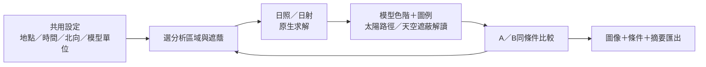
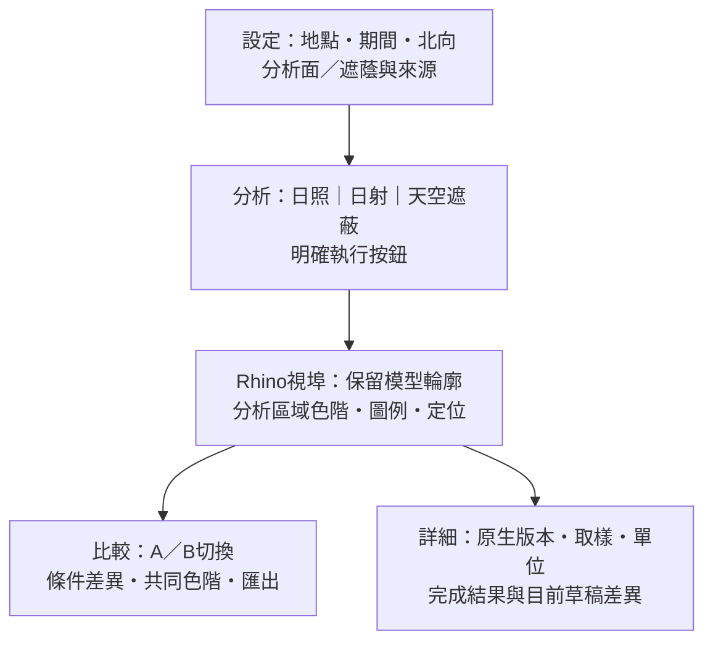

# 視覺優先與流程瘦身：優化版開發計畫

日期：2026-10-03。依使用者要求調整整體計畫；本文件為目前交付策略，取代舊計畫「先完成全部122入口，再展開大型視覺互動」的排程前提。122入口保留能力目錄與追蹤；近期不承諾全部做成獨立介面。程式仍為正式0.9.2、候選0.10.7；這次只調整計畫與知識文件。

## 1. 核心決策

**先交付可用的日照設計工作流程：設定一次 → 選擇分析區域 → 在Rhino模型看結果 → 比較方案 → 匯出說明。** 視覺化是第一版的核心，不等待完整元件接入或第二版框架。

近期產品只回答三個問題：「哪裡日照不足？」「為什麼被遮蔽？」「調整後是否改善？」SunPath、Direct Sun Hours、Incident Radiation保留不同物理意義，以同一工作區切換；Sky Mask補上遮蔽原因。Solar Envelope排在可試用版本之後。

衡量進度改用「完整工作流程通過驗收」與「使用者能完成設計判斷」，元件覆蓋數仍作技術盤點，不當產品完成百分比。

## 2. Jifto案例：有依據的借鏡

Henning Larsen公開的[技術衍生公司公告](https://www.henninglarsen.com/news/we-have-launched-a-tech-spin-out)介紹Nflection與Jifto；[Jifto官方網站](https://jifto.com/)定位為Rhino 8工具。公開資料可支持其產品化與設計體驗，尚不足以證明營收、留存或商業成功幅度。以下為產品觀察及本專案推論，不把它們當成已知的成功因果或內部研發流程。

| 可觀察做法 | 本專案採用方式 | 必須區分的界線 |
| --- | --- | --- |
| 以設計問題組織多種工作流程，共用場址起點 | 初期聚焦日照工作區，共用地點、時間、北向與模型來源 | 不照搬全部模組與GIS資料服務 |
| 模型中的日照、陰影與太陽路徑協助判斷 | 優先分析區域色階、模型可讀性、圖例及定位 | 日照時數h與日射kWh/m²分開呈現 |
| 文件說明方法、解析度、假設，並提供日照／風場驗證報告入口 | 保留原生Ladybug比較，發布附條件與證據摘要 | 網站報告不能替代本機求解驗證 |

來源：[Jifto流程與方法文件](https://jifto.com/docs/)、[Sunlight產品說明](https://jifto.com/sun/)、[Sunlight操作文件](https://jifto.com/docs/sunlight/)。

官方方法文件列出OptiX GPU光線追蹤與GPU格子玻爾茲曼風場；本專案目前採Ladybug／Grasshopper原生求解與Radiance日射後端。**借鏡介面與工作流程，不移植速度宣稱。** GPU替換是後續獨立研究，先驗證數值、硬體條件及收益才決定；不納入本次MVP。

## 3. 保留、整合、延後

| 處置 | 項目 | 效益與限制 |
| --- | --- | --- |
| 保留 | C#／.NET、Core／Adapters／Plugin、RhinoCommon／Eto、原生Ladybug、單一HubWorkspacePanel | 延續已有契約與驗證，避免改框架造成重做 |
| 保留 | 完成結果、草稿、文件隔離、owned preview、日照方案JSON | 失敗不丟結果；匯入仍是歷史資料，不自動綁模型 |
| 整合 | 太陽路徑、日照時數、日射的導覽與呈現入口 | 同工作區切換，底層Adapter及物理契約仍分開 |
| 整合 | 地點、時間、北向、模型選擇、錯誤提示及結果條件 | 用完成且明確接受的共用設定；不默默覆寫各模組草稿 |
| 整合 | 必要L1工具 | 先作流程依賴；確有獨立操作需求才做完整頁面 |
| 延後 | 全122入口逐一獨立操作、完整圖表／DataCollection工具宇宙 | 目錄保留，按試用需求分批，無完整交付日期承諾 |
| 延後 | CFD、耦合微氣候、採光、能耗、碳排、GIS自動匯入 | 跨引擎成本高，待核心流程獲得使用證據後投入 |
| 延後 | Web UI重寫、雲端協作、通用非同步任務框架、GPU替換 | 先做局部且可驗證的改善；耗時瓶頸再決定是否需要 |

不刪除舊功能、目錄與證據，不把未驗收功能改成完成。本輪策略調整不增加正式9／後端1／待接入112，候選10／1／111亦不變。

## 4. 介面與操作設計

Rhino視埠為主要閱讀區；單一側面板保留「設定、分析、比較」三個任務入口，進階與詳細驗證預設摺疊。以下為目標設計，尚未實作。

- 預設寬度沿用已修正的浮動策略；實際Dock窄／寬驗收後設定響應式規則，不每次強迫加寬。窄面板不放多欄長表或重複KPI。
- 改透明度、顯示層、圖例及相機只更新呈現；改模型、期間、網格或遮蔭則標示「條件已變更，需重新分析」。不把舊結果當作新求解。
- 探索與細查模式使用原生有效參數，清楚顯示時間取樣及網格；兩者都需數值驗證。探索不代表法規合規，也不預先承諾即時速度。
- A／B初版同模組比較：共同單位與相機；共同圖例範圍須透過原生支援且已驗證的圖例參數建立，不事後任意重塗原生網格。若無法合法對齊，保留各自原生色階並明示範圍。條件不相同時顯示差異；幾何取樣不能一一對齊時只並列摘要，不產生假差值色圖。
- Sky Mask首批單分析點，呈現原生天空可見／遮蔽幾何、來源點與遮蔭定位；多點批次、全年連動與複雜動畫後排。
- 匯出先做當前視圖PNG＋精簡HTML摘要及既有JSON連結；固定條件、原生版本、模型來源及日期。截圖不取代完整數值，不先做完整報表編輯器。
- 未驗證的百分比與取消不顯示成可用能力。GH求解涉及UI執行緒／ActiveDoc，不能直接Task.Run解決。

## 5. 分階段交付與預算

基準：一位熟悉專案的工程人員＋AI輔助、全時8小時／人日、5日／週；各列為尚需工作量的工程假設，非實測速度。共用工作只算一次，預備量25%只在階段合計加一次；等待同仁、授權、硬體與外部排程不計入人日。

| 工作包 | 未加預備量人日 | 交付／出口門檻 |
| --- | --- | --- |
| A0 現有候選操作收尾 | 3–6 | 原生檔案選取／成功存檔、Dock窄寬、深色、鍵盤及滑鼠操作；失敗與取消保留狀態 |
| A1 共用日照視覺工作區 | 2–4 | 保持原生契約的導覽與顯示整合；模型可讀、來源與過期狀態清楚 |
| A2 Sky Mask單點第一批 | 5–8 | 原生數值／幾何一致，點與遮蔭定位、錯誤保留結果 |
| A3 A／B呈現與精簡輸出 | 2–3 | 日照同模組方案切換、共同色階與條件差異，PNG／HTML／JSON可追溯 |
| A4 發布回歸與小型試用 | 3–5 | 新案例、相關回歸、第二台機器；至少兩位目標使用者完成流程並記錄阻礙 |
| A5 .NET／Rhino相容性探查 | 3–6 | 宿主支援、組件載入與原生求解測試，提出遷移決策；不含實際重大遷移 |
| **A 日照視覺MVP合計** | **18–32** | **含25%後23–40人日，約5–8工作週** |
| B Solar Envelope第一批＋針對性驗收 | 10–18 | 原生兩種模式與界線／單位清楚；依A的框架重用，實際選項邊界仍需探查 |
| **B追加預算** | **10–18** | **含25%後13–23人日，約3–5工作週** |

A＋B合併：未加預備量28–50，統一加25%及向上取整為**35–63人日，約7–13工作週**。單獨預算的四捨五入不可直接相加當合併預算。B在A試用通過後才投入；LB-073 View Percent與UTCI以需求與依賴評分另估，不暗中放入這個總額。

原近期L2估算38–70人日包含更廣必要依賴與Solar Envelope；新A先交付較窄且完整的使用流程，故能較早試用。這是範圍與順序調整，**不代表相同工程量自動變快**。舊完整122入口309–677人日是歷史全量獨立介面情境，見[完整技術評估](TECHNICAL_ASSESSMENT_2026-10-03.md)；不作新MVP期限，也不宣稱全部能力可在5–8週完成。

相容性探查需在早期安排：[Microsoft生命週期政策](https://dotnet.microsoft.com/en-us/platform/support/policy)列.NET 8支援至2026-11-10；[Rhino官方遷移說明](https://developer.rhino3d.com/guides/rhinocommon/moving-to-dotnet-core/)需與實際宿主版本核對。若需要重大遷移，重新估算與排程，不能以換TargetFramework就視為完成。

## 6. 測試與開發流程瘦身

每批只同時推進一個主要工作包，先列可見成果與出口門檻，再做最小實作。先讓Sun Hours操作閉合，再把視覺呈現整合；Sky Mask可先獨立原生探查，但正式發布仍需完成UI門檻。

| 時點 | 必須檢查 | 可避免的重複 |
| --- | --- | --- |
| 純文件修改 | 連結、範圍、估算、雙端讀回 | 不重跑物理求解並聲稱新增驗證 |
| 介面／顯示修改 | Build、相關原生操作、結果不變、owned preview、必要窄寬／主題檢視 | 不為每個文案修改重跑全部求解 |
| Adapter／輸入契約修改 | 原生數值／幾何、邊界與錯誤、清理／狀態；相關跨模組回歸 | 不用截圖代替數值 |
| 發布候選凍結 | 完整既有回歸一次、新功能全部門檻、目標載入、原生UI及跨機試用 | 未改候選且無新疑點，不反覆重跑同一全量套件 |

影像／UI自動化阻塞時，限定0.5–1人日調查，再安排受控測試文件的人工驗收；未觀察到的項目仍是待驗收。此安排不解除門檻，也不操作使用者工作模型。

保留302項0.10.7歷史檢查及原始證據；新增只記本次變更與執行結果。未來建立一份證據manifest引用版本化資料、測試／圖像和SHA，減少各報告重複整份輸出，不刪現有證據。

## 7. 知識管理瘦身

主文件分工：本文件管理活動範圍／預算；PROJECT_STATUS管理事實；版本化驗收＋manifest管理證據。ROADMAP與L2／Ladybug計畫只保留本次優先序摘要及連結，不複製整套新計畫。原技術評估保留作歷史全量比較基準。

Notion沿用既有資料庫與固定ID：詳細計畫PLAN-VISUAL-001；PLAN-000／PLAN-002及KB-002提供重點；固定KB-003呈現流程圖、階段出口與已完成／待驗收。只在有實際進度時更新，數字與本機來源一致；不額外建每日報告或定期通知。

## 8. 評估指標與後續排序

以下是試用目標，尚未測得：首次小型案例設定到可解讀結果目標5分鐘內（分開記錄操作與求解時間）；兩位使用者能指出結果區域、單位、條件及方案差異；第二台機器無開發者介入能完成一輪。若求解慢，記錄幾何量／時間取樣／硬體／時間後再設速度門檻。

每包記錄實際人日、返工及主要阻塞，A0／A2／A4完成後重估。下一功能依「設計用途與頻率、可視成果、原生依賴、測試／部署成本」排序，先用低成本且可驗證的能力回答常見問題。

| 後續方向 | 何時進入 | 預先需要的證據 |
| --- | --- | --- |
| Solar Envelope | A通過後的預設B主線 | 原生模式與使用者量體需求 |
| View Percent／其他幾何 | 使用者需要視域判斷時再排 | 清楚眼點／分析面問題、取樣與原生驗證 |
| UTCI與兩種必要圖表 | 小型日照流程有使用紀錄後 | 對齊氣象、輻射與風資料，適用條件／缺失處理 |
| Eddy3D單風向PoC | 核心流程穩定且有明確風場需求 | 實際OpenFOAM部署、收斂與基準案例；另估預算 |
| GPU／背景worker | 基準測試證實等待為主要瓶頸 | 合法執行緒／程序隔離、原生等效性、硬體成本 |

最大收益是較早把已做出的結果交給使用者，讓下一批投入有依據。完整能力庫長期保留，但發布不再被122個獨立頁面或全引擎藍圖綁住。

## 9. 執行起點與相關文件

下一次功能開發先做A0的原生操作驗收清單與缺陷收斂，再做A1的共用日照呈現；不在本次計畫編寫中改版本、求解器或宣告發布。

[目前狀態](PROJECT_STATUS.md) · [階段計畫](ROADMAP.md) · [L2計畫](L2_VISUAL_PLAN.md) · [Ladybug能力計畫](LADYBUG_DEVELOPMENT_PLAN.md) · [UI規範](UI_UX_STANDARD.md) · [試用驗收](PILOT_ACCEPTANCE.md) · [知識索引](KNOWLEDGE_INDEX.md)。
