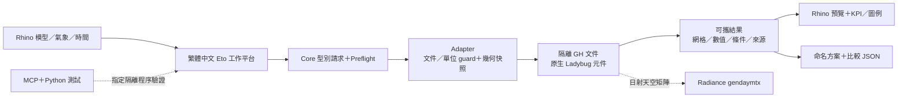
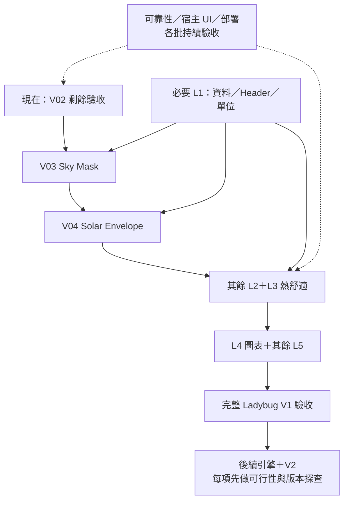

# Environmental Simulation Hub｜技術、難點、後續功能與工期完整評估

評估日期：2026-10-03（臺北）。程式碼基準：`7dd5e01`；正式交付版本 **0.9.2**，開發候選 **0.10.7**。本文件由目前原始碼、版本化驗證、122 入口目錄及官方技術文件整理。工期是**初步工程估算**，不是已承諾交付日期，也不是已量測的開發速度。

## 1. 決策重點

目前已建立可工作的 Rhino 環境分析平台：原生 Ladybug 求解、型別化輸入／結果、繁體中文介面、結果預覽、方案比較及驗證證據均有基礎。開發正在 **V02 日照時數的宿主操作驗收**，其後才接 V03 Sky Mask、V04 Solar Envelope。完整 Ladybug 的大部分入口仍待接入；CFD、採光、能耗、碳排與第二版大型互動介面均屬後續工作。

| 問題 | 評估結論 |
| --- | --- |
| 採用哪些核心技術？ | C#／.NET 8、RhinoCommon、Eto.Forms、Grasshopper／GH_IO、原生 Ladybug UserObject／Python 生態、日射使用 Radiance gendaymtx；Python／PowerShell／MCP 用於開發驗證，Git 與 Notion 用於版本及知識管理 |
| 最主要的已解難點？ | 單一平台導覽、模型單位與時間取樣、失敗保留結果、預覽歸屬、SunPath 文字尺度、首次浮動寬度、停靠外框重建時資料保留、日照方案跨程序恢復，以及 MCP 內層錯誤辨識 |
| 現在最主要的瓶頸？ | 完整宿主介面操作驗收、同步求解的 UI 阻塞／缺少取消、DataCollection 等共用契約、大型模型效能與外部依賴部署；另須規劃 .NET 版本生命週期 |
| 近期 L2 第一批需多久？ | 從本基準起，V02 收尾＋Sky Mask＋Solar Envelope＋必要依賴／一次試用，規劃 **38–70 人日，約 8–14 個工作週** |
| 完整 Ladybug V1 需多久？ | 122 入口逐項有操作與驗收，加上共用平台品質，初步 **309–677 人日，約 16–34 個規劃月**；單一工程人員、AI 輔助、全時投入 |
| 再包含後續引擎與 V2？ | 下文界定的 CFD／採光／能耗／碳排初版與 V2 另需 **208–369 人日**；順序完成總計 **517–1046 人日，約 26–53 個規劃月**，信心低，必須分批重新估算 |

近期估算是完整 Ladybug 估算的一個子集合；不能把兩者相加。上述月數以每月 20 個工作日換算，屬排程尺度，不是從今天起的確定曆月。假期、審核、使用者可配合驗收時間、長時間求解及環境等待需另列。

## 2. 目前功能與驗證基準

| 範圍 | 已完成／目前狀態 | 支援界線 |
| --- | --- | --- |
| 氣象、地點、時間 | 正式 7 項：Construct Location、Import EPW、Import STAT、Import DDY、Analysis Period、Calculate HOY、HOY to DateTime | EPW 目前採 8760 非閏年逐時資料；資料型別、缺值、次小時及月資料不能混用 |
| 日射 | LB-063 Incident Radiation 已正式接入；LB-049 Cumulative Sky Matrix 作後端 | 不代表完整採光引擎；輸出 kWh/m²，格點平均不是面積加權 |
| 太陽路徑 | LB-057 SunPath 幾何第一批正式交付 | 位置、向量、曲線、文字與四種投影；部分著色／條件／夏令時間等選項待補 |
| 日照時數 | LB-061 候選已求解及原生比對；0.10.7 加入方案匯入／恢復 | h 是太陽取樣權重，非照度；匯入為歷史比較，不重建舊模型或重新求解 |
| 平台 | 候選是一個註冊面板、8 個快取內部模組 | 文件內保留資料；未匯出的工作階段資料在 Rhino 結束後不保留 |
| 後續引擎 | Eddy3D 組件曾確認載入；CFD 求解尚未驗證 | 元件已安裝／載入不能當作求解引擎已可用 |

Ladybug 目錄共 **122 入口（119 元件＋3 ValueList）**。正式為 **9 獨立／1 後端／112 待接入**；候選為 **10／1／111**。一個入口可能有多個選項與流程，功能數量不等於工程工作量。[目前狀態](PROJECT_STATUS.md)、[全量目錄](evidence/ladybug_feature_catalog.json)。

0.10.7 的最新指定範圍共 **302 項檢查**：

| 驗證層級 | 數量 | 實際證明 |
| --- | ---: | --- |
| 全平台原生回歸 | 161 | 地點／氣候／時間、日射、SunPath、日照、單位重綁及平台既有路徑 |
| 方案契約 | 42 | 舊格式相容、整批檢核、名稱／容量、資料結構、統計、網格及比較條件 |
| Rhino 方案匯入 | 17 | 正式 API 操作、錯誤整批拒絕、不改模型、資料保留 |
| 狀態與文件隔離 | 32 | 模組切換、停靠相關操作、重開、獨立外框、文件隔離／關閉 |
| 新 Rhino 程序恢復 | 13 | 六個方案、完整 NativeResult、中文名稱、比較選擇與再次匯出一致 |
| Core | 25 | 核心契約與輸入檢核 |
| MCP 工具 | 12 | 工具對 JSON-RPC、內層錯誤及執行例外的辨識 |

建置零警告／零錯誤；新版 4 張 320／480 淺色離屏圖已檢視，21 個成功 MCP 呼叫另核對內層回應。這些結果是前輪已保存證據，本次文件評估未重跑求解。完整 Dock、深色、全鍵盤、滑鼠後選及原生匯入／比較成功存檔仍待完成。0.10.7 的宿主重用了外框，沒有把它寫成新的外框重建證明；0.10.6 才有該特定證據。[驗證紀錄](HOME_VALIDATION_0107.md)、[交付核對](evidence/archive_0107/delivery_audit.json)。

## 3. 現有技術架構與選型理由

### 3.1 技術分層

| 層次 | 現有技術／實作 | 責任與選型理由 | 成本／限制 |
| --- | --- | --- | --- |
| 宿主與幾何 | Windows、Rhino 8、RhinoCommon | 文件、物件 ID、Brep／Mesh、模型單位、視埠及指令；直接使用設計模型 | 綁定宿主生命週期與 UI 執行緒；目前不宣告 Mac 支援 |
| 應用外掛 | C#，Plugin／Adapters 目標 net8.0-windows，輸出 .rhp | 正式指令及面板入口；以本機 Rhino／GH DLL 引用建置 | 本機 SDK／宿主版本要相容；目前沒有多宿主版本完整部署矩陣 |
| 介面 | Eto.Forms／Eto.Drawing；HubUi、HubVisuals、HubText | 原生控制項、繁體中文、主題與六階段流程；集中呈現規則 | Eto 可跨平台不代表本專案已跨平台；停靠、主題、焦點與 modal dialog 要在宿主另驗 |
| 工作平台 | HubWorkspacePanel／IPanel，依文件保存快取模組 | 指令都導向同一平台；外框與資料生命週期分離 | 保存在記憶體的 Panel 尚不等於可攜式 headless session model；新模組仍須文件隔離 |
| 核心契約 | net8.0 Core，C# records、preflight、Diagnostics | 請求、單位、可攜網格／數值與結果；不依賴 Rhino／GH 型別 | 新資料集合／熱舒適／引擎各需明確契約；不能把原生物件任意轉字串 |
| 求解轉接 | Grasshopper、GH_IO、GH_UserObject、隔離 GH_Document | 依已知名稱接線，執行已安裝原生元件，讀取原生輸出，再釋放文件 | 原生 Python／GH 型別與套件版本可能變動；需要來源身分與相容性測試 |
| 物理計算 | Ladybug 原生元件／Python 套件；日射的 Radiance gendaymtx | 保留原生物理模型；直射日照使用 Rhino CAD 射線交會 | Direct Sun Hours 不需 Radiance；日射天空矩陣需要外部 Radiance 執行環境 |
| 視埠結果 | Rhino Mesh、原生色彩、Hub owner 標記 | 保留 values／points／faces 對應，只清理自有預覽 | 高密度預覽與使用者模型可見性需要效能及生命週期驗收 |
| 方案與匯出 | System.Text.Json、schema、SHA-256、完整結果 JSON | 可追溯輸入、來源、版本、數值、網格、警告及時間；日照比較檔可往返 | 指紋不是外部資料真實性簽章；仍是手動檔案流程，沒有跨模組資料庫／背景備份 |
| 開發驗證 | Python、PowerShell、Rhino MCP router／JSON-RPC，C# console checks | 精準指定隔離 slot／文件，保存原始回應與版本化 evidence | MCP 是開發控制／測試通道，產品面板直接走 SDK／Adapter；桌面操作仍有單獨驗收成本 |
| 版本與知識 | Git、版本化 artifacts／manifest、Markdown／JSON／HTML、Notion | 程式與證據可追溯；詳細紀錄／重點／視覺化三層 | 目前只有地端提交；遠端上傳及完整 CI／部署未閉合；雲端本機路徑只是追溯資訊 |

專案沒有以 Web 前端、雲端服務或 AI 取代物理求解器。AI 在這裡協助開發、檢查及文件工作；產品計算值仍來自原生元件。`UseWindowsForms` 是目標框架設定，面板主要 UI 為 Eto；不能只看到該設定就把產品描述成全 WinForms 或 WPF。

原始碼依據：[Plugin 專案](../src/EnvironmentalHub.Plugin/EnvironmentalHub.Plugin.csproj)、[Adapters 專案](../src/EnvironmentalHub.Adapters/EnvironmentalHub.Adapters.csproj)、[Core 專案](../src/EnvironmentalHub.Core/EnvironmentalHub.Core.csproj)、[平台生命週期](../src/EnvironmentalHub.Plugin/HubWorkspacePanel.cs)、[註冊入口](../src/EnvironmentalHub.Plugin/HubPlugin.cs)、[日照 Adapter](../src/EnvironmentalHub.Adapters/LadybugSunHoursAdapter.cs)、[日射 Adapter](../src/EnvironmentalHub.Adapters/LadybugRadiationAdapter.cs)。RhinoCommon／Eto 的官方定位見 [RhinoCommon 說明](https://developer.rhino3d.com/guides/rhinocommon/what-is-rhinocommon/)。

### 3.2 執行與資料流

重型求解是使用者明確執行的動作，欄位變更不自動啟動。Adapter 先核對目標文件為 ActiveDoc、模型尺度、元件與輸入；求解後驗證有限數值、取樣點／網格面／色彩對齊，再轉成 Core 結果。GH 文件及幾何快照由 Adapter 清理；UI 不自行解讀 Ladybug 內部 Python 物件。

這個分層適合繼續擴充。新增功能應增加契約、Adapter 與既有平台內部視圖；不必重寫 Ladybug 物理核心。若未來改用原生 Python API／CLI 或獨立程序，仍需保留同樣的請求／結果及原生比對門檻。

### 3.3 版本及支援生命週期

現有家用機驗證曾記錄 .NET SDK 8.0.425、Rhino 8.35.26251.13001、Runtime 8.0.31。這是保存的本機實測快照，不能當作所有目標機器的版本。官方說明 Rhino 8.20 起預設 .NET 8；宿主 runtime、建置 SDK 與外掛 target framework 是三個要共同確認的條件。[Rhino .NET 遷移文件](https://developer.rhino3d.com/guides/rhinocommon/moving-to-dotnet-core/)、[本機快照](evidence/home_0102/acceptance.json)。

Microsoft 列出 **.NET 8 的支援結束日期為 2026-11-10**。目前評估日尚在支援期間，但長期計畫會跨過該日期；需先做 3–6 人日的相容性探查，確認 McNeel 支援的宿主／runtime 組合、RhinoCommon／Eto／GH／原生元件與第三方外掛回歸。不能只把 csproj 改成 .NET 10 就視為完成升級。[Microsoft 官方支援政策](https://dotnet.microsoft.com/en-us/platform/support/policy)。

本次沒有更換已驗證 runtime 或外掛目標。若探查證明需要實際宿主／runtime 遷移，另安排實作與完整回歸；其投入未混入 3–6 人日探查。McNeel 文件也列出 Rhino 9 的 .NET 10 方向，這是後續相容性資訊，不代表本專案已支援 Rhino 9。

## 4. 已解難點、部分解決及證據

| 難點 | 處理方式／已解範圍 | 剩餘界線與證據 |
| --- | --- | --- |
| 原生元件如何可靠接入 | 使用已安裝 GH_UserObject、命名端點、隔離文件及原生輸出，不以畫布座標／slider 索引當 API | 現有模組已驗，其他元件仍逐項接入；[GH 標準](GH_MODULE_STANDARD.md) |
| 單位、時間與取樣語意 | 明確公尺參數、模型尺度轉換；日照按 1/timestep 加權，保留 requested 與 sun-up 序列 | 非閏年／規則序列等支援邊界仍存在；[日照契約](../src/EnvironmentalHub.Core/SunHoursContracts.cs) |
| 單位改變後無法重新綁定 | 0.10.3 明確重選建立新綁定；舊綁定阻擋，無效重選保留結果 | 全部其他幾何模組仍需採同樣規則；[0.10.3 驗證](HOME_VALIDATION_0103.md) |
| 太陽路徑文字尺度過大 | 0.9.2 對自有文字物件覆寫尺度，不改文件樣式 | 各新圖表標籤仍須測不同單位與視圖；[SunPath](SUNPATH_MODULE.md) |
| 首次開啟面板太窄 | 0.10.5 只調整本平台第一次浮動外框；保留後續手動尺寸 | 已解浮動預設寬度，完整窄／寬 Dock 尚待驗；[0.10.5](HOME_VALIDATION_0105.md) |
| 停靠移動外框重建導致資料遺失 | 0.10.6 讓文件工作階段保存模組，外框卸下再掛接；文件關閉／退出才釋放 | 資料保存已驗，多視窗宿主 UI 仍待；[0.10.6](HOME_VALIDATION_0106.md) |
| 日照方案跨 Rhino 程序遺失 | 0.10.7 比較 JSON 保存完整原生結果，整批檢核後追加，重新計算比較文字 | 六方案新程序恢復已驗；手動匯出，其他模組及原生成功選檔尚待；[方案契約](SUNHOURS_SCENARIO_ARCHIVE.md) |
| 來源摘要相同卻有不同太陽條件 | 0.10.7 同時核對實際地點／北向／時間／HOY／向量及元件來源 | 外部檔真實性、模型幾何重建與科學指標等價仍另處理；[Archive](../src/EnvironmentalHub.Core/SunHoursArchive.cs) |
| MCP 有回應卻把腳本例外當成功 | 工具核對 error／isError／payload 與附加 traceback，12 工具檢查通過 | modal dialog、router 重新接管及程序退出仍會阻礙測試；[探測器](../tools/mcp_probe.py) |
| 測試工具使隔離 Rhino 退出 | 已確認 0.10.7 測試 Timer 呼叫不存在的 RhinoApp.AsyncInvoke；改用 Eto Application AsyncInvoke，保存堆疊 | 這是自建測試程序的工具錯誤，產品沒有該 API；舊 router 錯誤截圖的根因不據此推定；[驗證紀錄](HOME_VALIDATION_0107.md) |
| Windows 換行改變證據位元組 | 保留歷史原檔 SHA，修正新寫入工具的換行設定 | 版本化證據不可為美化而覆寫；[產生工具](../tools/prepare_archive_resume_0107.py) |

這些已解問題主要提升可靠性、可用性與資料保存，不會各自增加 Ladybug 功能數。最新候選與正式驗收須分開追蹤；模組文件中的舊章節保留當時版本，當前狀態以 PROJECT_STATUS 與版本化 evidence 為準。

## 5. 未解瓶頸與處理策略

| ID／優先序 | 未解問題與實際影響 | 建議處理／出口條件 | 工期歸屬與信心 |
| --- | --- | --- | --- |
| R01／P0 | 原生匯入選檔、比較成功存檔、完整 Dock／深色／鍵盤／滑鼠後選仍待；阻礙 V02 正式交付 | 在自建隔離宿主完成窄／寬、主題、焦點、成功與取消；保存實際畫面和 JSON 讀回 | 近期 V02 收尾 3–6 人日；中低，宿主擷取不可用時會延長 |
| R02／P0 | 同步 GH 求解在 Rhino UI 執行緒；大工作會阻塞、沒有可靠取消或百分比 | 先量測快照／求解／呈現；再探查獨立 Rhino／CLI worker、狀態機、timeout、owned process 結束及失敗恢復 | 共用執行器 15–25 人日；低；若原生元件無可用程序邊界須重新估算 |
| R03／P0 | .NET 8 支援接近結束；長期開發跨越期限 | 鎖定目前基準，先做宿主相容性矩陣及回歸 PoC，排定可支持的升級路徑 | 探查 3–6 人日；實際遷移另估，低 |
| R04／P1 | DataCollection／Header／DataType／單位契約不足；限制熱舒適與圖表 | 保留值、時間、頻率、單位、型別、Location、metadata；往返重建與異常路徑逐項原生比對 | 共用契約 12–20 人日，後續入口另估；中 |
| R05／P1 | 大型複雜模型沒有充分容量基準；密網格×大量時刻增加交會、記憶體與預覽成本 | 設定標準大小／中／大案例，量測各階段、峰值 RAM、輸出大小；允許先以粗網格／短期間試算 | 共用品質 10–18 人日內含第一批量測；不能預先承諾加速倍率 |
| R06／P1 | 歷史匯入只恢復日照比較；其他模組、方案搜尋／重命名、背景保存及遷移規則不足 | 將 session model 與 UI 分離，定義跨模組 source／units／schema migration，先做日射往返再擴大 | 可選跨模組方案初版 6–12 人日；未列入完整 Ladybug入口必備範圍 |
| R07／P1 | 原生 UserObject／Python／Rhino／Radiance 版本與路徑相依 | 環境 manifest、元件 UUID＋SHA、版本確認、受支援組合與失敗提示；只升級受測組合 | 共用部署 6–12 人日；中低 |
| R08／P1 | 開發機證據不能替代同仁／跨機部署；中文與含空白路徑、權限政策可能有差異 | 至少一部新機、標準案例、無協助操作、安裝／更新／回復實測；正式發布出口包含這些結果 | 近期試用包／共用部署內含；使用者與 IT 等待另列 |
| R09／P1 | MCP 與模態對話框的測試協調不穩，不能無條件連續自動化 | 只對本次 owned slot 操作，異步用已支持 API，核對返回與產物；UI 驗收可有可重現人工腳本 | R01／品質成本內含；MCP 最新成功證據不等於目前任何 slot 都可用 |
| R10／P1 | 比較的科學語意跨模組不同；相同 SHA、相同平均不證明同等性能 | 揭露地點／時間／取樣／網格／遮蔭／版本；定義按點／面積／時間加權與有效可比條件，必要時停止顯示差值 | 各模組契約與驗收內含；面積加權等新指標須另驗 |
| R11／P2 | Git 地端可追溯，但遠端上傳與完整 CI／依賴發布流程未閉合 | 補遠端授權、純 Core 自動檢查、具宿主／授權的受控 runtime 驗收、manifest 與回復流程 | 共用部署／文件內含；不把一般雲端 CI 當可直接執行 Rhino 的環境 |

Rhino 提供把工作調度到 UI 執行緒的 SDK API，但它不代表 GH、活動文件及 Python 元件可以任意放進 Task.Run。目前 Adapter 也明確阻擋非 UI 執行緒／非 ActiveDoc；非同步架構必須以實測探索，不能只加一個 async 按鈕。[Rhino UI 執行緒 API](https://mcneel.github.io/rhinocommon-api-docs/api/RhinoCommon/html/M_Rhino_RhinoApp_InvokeOnUiThread.htm)、[日照 Adapter](../src/EnvironmentalHub.Adapters/LadybugSunHoursAdapter.cs)。

日照 JSON 的 64 MiB／20 方案限制已有，仍需留意解析、複製網格與快取占用的記憶體；檔案上限不是執行時 RAM 上限。外部檔只做資料檢核、不執行其中內容。這降低匯入副作用，但不是完整安全稽核或真實性認證。

## 6. 後續功能、依賴與技術評估

### 6.1 Ladybug 主線

| 批次 | 預計成果 | 可重用／新增依賴 | 主要難點與驗收 | 優先序 |
| --- | --- | --- | --- | --- |
| V02 日照收尾 | 同仁可以完成選取、求解、比較與檔案往返 | 現有求解／方案契約／平台 | 需成功原生檔案操作及完整宿主 UI；API 驗證不能替代 | 立即 |
| V03 Sky Mask | 分析點／平面的天空可見與遮蔽網格；3D／投影與條件 | 原生 LB-067、Brep／Mesh、點／平面契約與預覽 | 區分點的 Sky Exposure 與平面的 Sky View；方向、遮陽策略、density、尺度與投影對齊 | 下一批 |
| V04 Solar Envelope | 日照條件形成的可檢視邊界網格 | 原生 LB-068、已完成太陽向量、幾何快照／單位 | 區分 solar collection／solar rights；原生障礙需水平平面 Brep／曲線，不能直接假設所有建築量體適用；height limit與拓樸 | 其後 |
| L1 B01–B04 | Location 解構、期間套用、Data／Header／DataType、單位轉換 | 現有 EPW／期間；新可攜 DataCollection 契約 | 時間頻率、缺值、單位、型別及往返不能只保存標籤；依 L2／L3／L4 需要插入 | 按依賴 |
| L1 B05–B06 | 設計日明細、EPW to DDY、下載／EPWmap、剩餘氣象入口 | DDY／STAT／資料契約、檔案與網路流程 | 正確檔案寫入、下載／解壓錯誤及環境範圍，需把純分析與副作用分開驗 | 中期 |
| L2 其餘幾何 | View Percent、View Factors、Human to Sky、視線／遮陽效益等 | 天空／幾何、熱舒適或資料契約 | 面／點可見範圍、加權與不同遮陽效益模型；不能從一個 Sky Mask 直接宣告其他入口完成 | 中期 |
| L3 熱舒適 | PMV、Adaptive、UTCI、PET、MRT 等 | 完整資料型別、單位、人體／舒適參數 | 代謝／服裝／風速／濕度／MRT、室內外適用條件、原生有效範圍及錯誤路徑 | L2 與必要資料後 |
| L4 圖表 | Wind Rose／Profile、Hourly／Monthly、Psychrometric、comfort polygons、sky／radiation圖表 | DataCollection、統計、Legend、資料及幾何呈現 | 風向不能作普通算術平均；資料／圖例／標籤／縮放一致，密集年度數據的可讀性 | 按使用價值 |
| L5 工具／維護 | Matrix、Legend、mesh／view、儲存／載入、3個 ValueList、版本工具 | 各自原生入口；部分已為分析所需 | 43 Extra＋4 Version入口不能都當簡單 UI；副作用、視圖、磁碟與原生檔案同步各驗 | 與主線並行依賴，完整範圍保留 |

Sky Mask 與 Solar Envelope 的原生語意來自本輪查核的官方 Primer，實作時仍要對齊本機已鎖定元件，不自動替換遠端版本。[Sky Mask 官方說明](https://docs.ladybug.tools/ladybug-primer/components/3_analyzegeometry/sky_mask)、[Solar Envelope 官方說明](https://docs.ladybug.tools/ladybug-primer/components/3_analyzegeometry/solar_envelope)。這兩項的幾何與單位驗收已納入其工期。

依賴圖呈現工作群組，不表示所有 L1 先完成才可開發 L2。UserObject 身分、原生選項、科學單位及操作驗收仍以每個入口為單位追蹤。

### 6.2 額外引擎與第二版 UI

| 範圍 | 候選技術與交付界線 | 不確定性／先做的驗證 | 增量人日，未加 25% 預備量 |
| --- | --- | --- | ---: |
| Eddy3D CFD 初版 | 引擎探查 5–10、單風向 15–25、多風向／一種風舒適準則 20–35；含網格、殘差／收斂紀錄、風速／向量／流線 | 本機引擎路線、安裝政策、mesh quality、邊界條件、結果定位與外部程序結束；不直接展開耦合微氣候 | 40–70 |
| 採光初版 | Honeybee／Radiance；單時刻照度、年度指標及一種眩光流程 | sensor grids、材質、天空／配方、年度排程、輸出量與真實基準模型；不是現有 Direct Sun Hours 延伸一個單位 | 35–60 |
| 能耗初版 | Honeybee／OpenStudio／EnergyPlus；單棟模型、材料、排程、年度求解／結果 | zone／surface拓樸、構造、使用排程、HVAC界線、引擎版本及診斷；模型前處理常比按下求解更難 | 35–60 |
| 碳排初版 | 明定資料源的營運與材料碳排計算；利用能耗與材料數量 | 地域／年份因子、生命週期範圍、材料／EPD匹配、來源版本與資料權利；目前未選定完整資料源 | 15–30 |
| V2 大型互動介面初版 | 先設計／技術 PoC 8–15、互動實作25–45、操作驗收8–15；保留Core／Adapter | 方案探索、viewport同步、圖表互動、結果查詢；Eto強化或嵌入Web／GPU方案尚未選型，須量測資料橋接／宿主整合 | 41–75 |

以上是界定範圍的第一版增量，完整商業級引擎產品與所有選項仍需另估。Outdoor+ 耦合風／熱／濕／輻射、室內 CFD、全 HVAC 庫、完整碳資料平台、雲端多人／BIM 雙向同步及通用參數最佳化沒有包含在總工期。耦合 Outdoor+ 若另啟動，可先留 **40–80 人日未加預備量**的低信心探查／初版占位，待真實案例再估。

Eddy3D 現行官方文件列出不同引擎部署路線，並說明 Outdoor 的 OpenFOAM／Radiance、Outdoor+ 的耦合模式與並行計算相容性注意事項。這表示後續要做**版本與部署探查**，不能直接把舊 metadata 或一般 OpenFOAM 安裝方式當成本機整合結論。此處未決定採 Docker、Podman、BlueCFD 或 WSL，也未安裝／更新引擎。[Eddy3D 官方文件](https://docs.eddy3d.com/latest/)。

Honeybee 官方將採光與能耗分別接到 Radiance、OpenStudio／EnergyPlus；因此需新模型契約、adapter與真實求解驗收。[Honeybee 官方說明](https://www.ladybug.tools/honeybee.html)。Carbon 及 V2 的估算是本專案工程判斷，沒有把外部產品頁面當作開發時間證據。

各引擎增量包括專屬模型／Adapter／部署與原生操作驗收；前面已計的共用平台不重建第二套。不同引擎的結果、輸入與診斷仍需分別接入。重用能降低重複工作，但在技術探查前沒有再從估算中扣除假定的加速收益。

## 7. 工期估算方法與假設

### 7.1 單位、人力與可信度

基準是假設 **1 位有 C#／Rhino／GH 經驗的工程人員，AI 輔助，1.0 全時投入**；1 人日＝8 小時，1工作週＝5人日，1規劃月＝20人日。使用者／領域專家可提供合理測試模型、物理判讀及可安排的驗收時間；這部分協作不等於已有人力或日期承諾。

目前沒有完整逐功能工時日誌或可靠速度分布。區間是依現有架構、原生資料型別、幾何／圖表複雜度、操作副作用及驗收成本作工程判斷；**不是 P50／P80 或統計置信區間**。AI 已包含於這個工作方式，不再另宣稱加速幾倍或將工期直接砍半。

| 成本種類 | 是否納入 |
| --- | --- |
| 每入口契約／adapter／基本操作／正常邊界錯誤／相關回歸／文件 | 納入入口估算；可重用共用基礎 |
| 共用 DataCollection、完整宿主品質、執行器、部署、既有功能剩餘選項、版本探查 | 另列共用工作包，每項計一次 |
| 開發中一般修正、重試及尚未細分的小變動 | 基本範圍加 **25% 預備量**；不是最大失敗情境保證 |
| 使用者／IT／授權等待、假期、硬體採購及外部長時間求解等待 | 不列人日；排程時另加實際曆時 |
| 重寫物理求解器／宿主重大升級／全面雲端化／耦合微氣候 | 不包含；需新的技術 PoC 及估算 |

### 7.2 完整目錄與工期數量的對齊

| 原生分類 | 全目錄 | 正式獨立 | 僅後端 | 候選新增 | 本估算要補的入口 |
| --- | ---: | ---: | ---: | ---: | ---: |
| 0 Import | 11 | 4 | 0 | 0 | 7 |
| 1 Analyze Data | 35 | 3 | 0 | 0 | 32 |
| 2 Visualize Data | 14 | 1 | 1 | 0 | 13 |
| 3 Analyze Geometry | 15 | 1 | 0 | 1 | 13 |
| 4 Extra | 43 | 0 | 0 | 0 | 43 |
| 5 Version | 4 | 0 | 0 | 0 | 4 |
| 合計 | **122** | **9** | **1** | **1** | **112** |

估算對象為候選的 **111 待接入＋LB-049 後端轉獨立流程＝112入口**。LB-061 已有候選功能，其剩餘宿主驗收列在共用工作包；已交付9項的未接選項另列共用工作。這樣既不遺漏後端獨立操作，也不將日照重做一次。原生分類與 L1–L5里程碑不一一對應，不能把 Extra 43項全當幾天可完成的選單。

每個待做入口的初步難度與人日放在附錄：S 簡單轉換／參數 0.5–1.5，M 一般資料／操作 1.5–3.5，C 複雜幾何／舒適／圖表 4–9。**Sky Mask 6–10、Solar Envelope 8–15、天空矩陣獨立流程4–7**為個別調整。S／M／C只是估算分類，實作前需重新核對；小入口仍需真正原生資料及副作用驗收。

### 7.3 可重算的完整 Ladybug 工作量

| 工作包 | 下限人日 | 上限人日 |
| --- | ---: | ---: |
| S：43 個入口 | 21.5 | 64.5 |
| M：47 個入口 | 70.5 | 164.5 |
| C：22 個入口，含個別調整 | 94 | 203 |
| 入口合計 | **186** | **432** |
| V02 完整宿主操作收尾 | 3 | 6 |
| 共用 DataCollection／Header／型別與單位 | 12 | 20 |
| 既有 SunPath／日射／日照進階選項 | 8 | 15 |
| 工作執行器、程序隔離與取消第一版 | 15 | 25 |
| 大型模型、完整主題／操作與跨模組回歸 | 10 | 18 |
| 跨機試用、依賴鎖定、發布與回復 | 6 | 12 |
| 全目錄、操作文件與 Notion 三層整理 | 4 | 7 |
| .NET／Rhino 生命週期相容性探查 | 3 | 6 |
| 共用工作合計 | **61** | **109** |
| 未加預備量合計 | **247** | **541** |
| 加25%，分別向上取整 | **309** | **677** |

公式為 `ceil((入口工作量＋共用工作量) × 1.25)`。25% 為顯式預備量，表內沒有再悄悄套用第二個風險係數。若原生機制、版本或範圍出現大幅變動，必須修改工作包，不能用預備量掩蓋。

這個「完整」指鎖定122入口的定義範圍與已列平台品質，**不是每種輸入排列、所有未來原生版本或所有案場均已驗證**。本次文件沒有變更正式目錄狀態。[可重算估算模型](evidence/technical_assessment_20261003/estimate_model.json)、[產生工具](../tools/build_technical_assessment.py)。

## 8. 近期里程碑排程與可交付成果

| 里程碑 | 增量人日，未加預備量 | 出口成果／驗收 | 排程依賴 |
| --- | ---: | --- | --- |
| M0：V02 收尾 | 3–6 | 成功原生匯入／比較存檔、宿主窄寬／主題／焦點／選取、正式日照交付證據 | 隔離 Rhino UI 可觀察／操作；必要使用者驗收時間 |
| M1：Sky Mask 第一批 | 6–10 | 原生可見／遮蔽網格、點／平面條件、定位／清理、比較與錯誤驗收 | M0；新可攜幾何／結果契約 |
| M2：Solar Envelope 第一批 | 8–15 | collection／rights 模式、障礙／尺度／高度限制、原生網格與結果追溯 | M1後排入；完成太陽向量與模型條件 |
| 必要 L1依賴 | 5–10 | 為上述三項所需的資料、單位與條件功能 | 可按需要插入，不等全部L1完成 |
| 首批整合／實際模型與跨機試用 | 8–15 | 相關回歸、一次新機安裝／首次求解、一般同仁操作回饋 | 測試模型、新機及人員可配合 |
| 合計 | **30–56** | 加25%後為 **38–70人日／8–14工作週** | 是順序規劃範圍，不指定確切日期 |

上述第一批不等於所有Sky Mask策略、所有Solar Envelope例外與剩餘L2皆完成；全功能補齊及共用品質仍包含在完整Ladybug預算。V02單獨加25%可先預留 **4–8人日，約1–2工作週**；如果宿主UI擷取／對話框仍無法可靠驗收，先記錄阻塞及替代可重現人工驗收，再重排。

若希望先擴大使用價值，可在這批之後選一條熱舒適流程（如UTCI，12–20人日）與兩種常用圖表（如Wind Rose／Hourly，14–24人日），先交付領域工作流程，再持續補完整目錄。合計基礎工作為 **56–100人日**，加25%為 **70–125人日／約4–7規劃月**。這是可選交付切片，包含前述L2成本，不與完整Ladybug預算累加，也不取消122入口最終範圍；具體熱舒適模型需依使用情境決定。

## 9. 人力投入與總時程情境

| 投入情境 | 完整 Ladybug V1 的排程尺度 | 解讀 |
| --- | --- | --- |
| 1人全時＋AI | 309–677工作日；約16–34規劃月 | 本估算基準；UI／原生求解仍需驗收 |
| 1人半時＋AI | 約31–68規劃月 | 以0.5投入比例換算；人日總量不減少 |
| 2位熟悉領域的工程人員＋AI | 初步約10–25規劃月 | 假設有效加速1.4–1.7倍，另留協調／啟動成本；是情境假設，非量測；宿主驗收、共享模型及共用契約不能線性平分 |
| 保留現有功能並完成近期L2 | 約8–14工作週 | 38–70人日，範圍明確、信心中低，最適合先做下一次承諾 |

兩人情境只是排程評估，沒有在本次啟動平行代理或假設新增人員已到位。可平行的是不同adapter／Core檢查／文件；共有契約、同一Rhino文件操作、版本發布及最終科學驗收仍需協調。人力增加不會把外部引擎的運算時間按比例縮短。

後續引擎與V2的未加預備量合計 **166–295人日**；加25%向上取整 **208–369人日**。完整Ladybug加這些初版為 **517–1046人日，約26–53規劃月**。這個長期範圍的信心低，且會跨越runtime／外部套件生命週期；應用分批探查與重估管理，不當作單一固定總價／交付承諾。

沒有提供確定完工年月，原因是尚未確定實際每週投入、新機／驗收可用時間、引擎版本／部署路線與V2範圍。已確定的近期期限只有外部 .NET 8支援生命週期，應獨立先處理相容性評估。

## 10. 如何縮短時間而保留品質

1. **先完成可交付切片。** 把V02成功操作與驗收閉合；Sky Mask、Solar Envelope依原生語意逐批接入，避免數值已完成但宿主品質長期欠帳。
2. **先做會被重用的資料契約。** DataCollection／Header／單位／schema migration可供L1、舒適、圖表與引擎共用；不能用一堆UI字串先繞過。
3. **用共用原生驗證工具，保留必要獨立基準。** 固定正常／邊界／錯誤／狀態保留／預覽歸屬檢查，減少重複測試腳本錯誤；不同物理模型仍各自有原生對照。
4. **先量測再優化。** 分別量測幾何快照、原生求解、結果轉換、JSON及預覽；瓶頸可能在宿主／交會／資料量，不能預設換UI或加CPU就能解。
5. **高風險項先做短PoC。** 獨立worker／取消、runtime升級及CFD引擎部署先確認可行；若假設失敗，立即改架構或範圍並重估。
6. **把操作驗收排成可重現工作。** 可在自建空白Rhino以明確步驟人工／SDK驗證必要對話框和主題，不依賴大量盲目桌面點擊，也不能用離屏截圖代替真實操作。
7. **一次維護同一知識來源。** 正式、候選、歷史及工期假設分開；主文件與估算模型供詳細追溯，Notion入口只放重點，KB-003維持可視圖。

本文件沒有推薦現在更換整套UI或重新實作Ladybug算法；現有Core／Adapter分層可繼續使用。需新增的是可靠執行邊界、可攜資料模型、宿主品質與受測部署流程。

## 11. 每批交付與重新估算規則

一項功能的完成需要：原生身分／SHA與參數核對、型別請求／結果、正常及邊界／錯誤比對、模型／單位／文件guard、真實窄寬版與操作、結果／預覽歸屬、匯出／保存邊界、版本化載入與相關回歸、目錄與地端／Notion三層同步。建置、API檢查、圖像與正式發布各有獨立出口。

每完成一個里程碑記錄實際分析／實作／原生數值／宿主操作／文件／環境排錯工時與等待曆時。累積至少幾個具有不同難度的入口後，修正S／M／C估算；不拿單一快速入口外推全部122項。

以下情形必須重新估算：原生版本／資料契約變動、宿主API／執行緒假設失敗、實際模型容量超出基準、加入新物理模型／副作用、部署平台改變、IT／引擎無法在目標機運行、增加V2互動或完整引擎選項。保留原估算與修正理由，而非覆寫成「一開始就知道」。

建議現在的實際承諾範圍是**V02收尾與runtime相容性探查**。探查結果明確後再承諾Sky Mask與Solar Envelope批次；完整122入口與後續引擎維持長期範圍追蹤。

## 12. 來源、狀態與本次交付範圍

### 本機事實來源

- [PROJECT_STATUS](PROJECT_STATUS.md)、[ROADMAP](ROADMAP.md)、[Ladybug全量計畫](LADYBUG_DEVELOPMENT_PLAN.md)、[L2計畫](L2_VISUAL_PLAN.md)、[知識索引](KNOWLEDGE_INDEX.md)。
- [0.10.7驗證](HOME_VALIDATION_0107.md)、[0.10.6驗證](HOME_VALIDATION_0106.md)、[0.10.5驗證](HOME_VALIDATION_0105.md)、[日照檔案契約](SUNHOURS_SCENARIO_ARCHIVE.md)。
- [功能目錄JSON](evidence/ladybug_feature_catalog.json)、[最新交付核對](evidence/archive_0107/delivery_audit.json)、[家用環境快照](evidence/home_0102/acceptance.json)、[同仁試用門檻](PILOT_ACCEPTANCE.md)。
- 原始碼來源已列於第3節；估算模型與完整112入口映射見第7節及附錄。

### 本輪查核的官方來源

查核日期均為2026-10-03；只用於技術語意、SDK及依賴／支援政策。工期由本專案工作分解估算，官方頁面沒有提供本專案開發時間。

| 來源 | 本文件採用的資訊 |
| --- | --- |
| [RhinoCommon](https://developer.rhino3d.com/guides/rhinocommon/what-is-rhinocommon/) | SDK與Eto原生介面定位 |
| [Rhino .NET遷移](https://developer.rhino3d.com/guides/rhinocommon/moving-to-dotnet-core/) | Rhino 8的.NET 8基準、runtime選擇與後續相容性方向 |
| [Rhino UI執行緒API](https://mcneel.github.io/rhinocommon-api-docs/api/RhinoCommon/html/M_Rhino_RhinoApp_InvokeOnUiThread.htm) | UI調度方法；不能據此宣稱任意GH元件可背景執行 |
| [Microsoft .NET支援政策](https://dotnet.microsoft.com/en-us/platform/support/policy) | .NET 8支援結束於2026-11-10 |
| [Ladybug Sky Mask](https://docs.ladybug.tools/ladybug-primer/components/3_analyzegeometry/sky_mask) | 點／平面可見天空語意、策略與投影 |
| [Ladybug Solar Envelope](https://docs.ladybug.tools/ladybug-primer/components/3_analyzegeometry/solar_envelope) | collection／rights、障礙幾何、網格與height limit |
| [Eddy3D](https://docs.eddy3d.com/latest/) | 模組與引擎部署路線、外部求解依賴 |
| [Honeybee](https://www.ladybug.tools/honeybee.html) | Radiance採光與OpenStudio／EnergyPlus能耗範圍 |

本次交付是文件與規劃評估，程式版本／正式功能數維持原狀。相關地端知識入口與既有Notion三層更新後，讀回結果保存為本輪同步receipt；舊驗證及同步receipt保留原始範圍。[本輪同步紀錄](evidence/notion_technical_assessment_sync_2026-10-03.json)。

## 附錄：112個待補入口的初步估算

以下逐項列出候選未接入的111入口及LB-049獨立流程。S／M／C、上下限是工程假設，不是驗收狀態。LB-061收尾／既有9項剩餘選項／共用品質另列一次，沒有混入下表。具體原生參數及部署條件仍需實作前重新核對。此表由已鎖定目錄與估算模型產生，總量應與第7節一致。

<!-- GENERATED_ENTRY_ESTIMATES -->

| 入口 | 原生名稱 | 難度 | 初步人日 | 狀態／範圍 |
| --- | --- | --- | --- | --- |
| LB-002 | LB Deconstruct Design Day | S | 0.5–1.5 | 待接入 |
| LB-003 | LB Deconstruct Location | S | 0.5–1.5 | 待接入 |
| LB-004 | LB Download Weather | M | 1.5–3.5 | 待接入 |
| LB-005 | LB EPW to DDY | M | 1.5–3.5 | 待接入 |
| LB-006 | LB EPWmap | M | 1.5–3.5 | 待接入 |
| LB-008 | LB Import Design Day | M | 1.5–3.5 | 待接入 |
| LB-010 | LB Import Location | S | 0.5–1.5 | 待接入 |
| LB-012 | LB Adaptive Comfort | C | 4–9 | 待接入 |
| LB-014 | LB Ankle Draft | M | 1.5–3.5 | 待接入 |
| LB-015 | LB Apply Analysis Period | M | 1.5–3.5 | 待接入 |
| LB-016 | LB Apply Conditional Statement | M | 1.5–3.5 | 待接入 |
| LB-017 | LB Apply Metadata | S | 0.5–1.5 | 待接入 |
| LB-018 | LB Apply Pattern | S | 0.5–1.5 | 待接入 |
| LB-019 | LB Arithmetic Operation | S | 0.5–1.5 | 待接入 |
| LB-021 | LB Clothing by Temperature | S | 0.5–1.5 | 待接入 |
| LB-022 | LB Comfort Statistics | M | 1.5–3.5 | 待接入 |
| LB-023 | LB Construct Data | M | 1.5–3.5 | 待接入 |
| LB-024 | LB Construct Data Type | S | 0.5–1.5 | 待接入 |
| LB-025 | LB Construct Header | S | 0.5–1.5 | 待接入 |
| LB-026 | LB Convert to Timestep | M | 1.5–3.5 | 待接入 |
| LB-027 | LB Data DateTimes | S | 0.5–1.5 | 待接入 |
| LB-028 | LB Day Solar Information | M | 1.5–3.5 | 待接入 |
| LB-029 | LB Deconstruct Data | M | 1.5–3.5 | 待接入 |
| LB-030 | LB Deconstruct Header | S | 0.5–1.5 | 待接入 |
| LB-031 | LB Degree Days | M | 1.5–3.5 | 待接入 |
| LB-032 | LB Directional Solar Irradiance | M | 1.5–3.5 | 待接入 |
| LB-034 | LB Humidity Metrics | M | 1.5–3.5 | 待接入 |
| LB-035 | LB Indoor Solar MRT | C | 4–9 | 待接入 |
| LB-036 | LB Mass Arithmetic Operation | S | 0.5–1.5 | 待接入 |
| LB-037 | LB Outdoor Solar MRT | C | 4–9 | 待接入 |
| LB-038 | LB PET Comfort | C | 4–9 | 待接入 |
| LB-039 | LB PMV Comfort | C | 4–9 | 待接入 |
| LB-040 | LB Radiant Asymmetry | M | 1.5–3.5 | 待接入 |
| LB-041 | LB Relative Humidity from Dew Point | S | 0.5–1.5 | 待接入 |
| LB-042 | LB Solar MRT from Solar Components | M | 1.5–3.5 | 待接入 |
| LB-043 | LB Thermal Indices | C | 4–9 | 待接入 |
| LB-044 | LB Time Interval Operation | S | 0.5–1.5 | 待接入 |
| LB-045 | LB UTCI Comfort | C | 4–9 | 待接入 |
| LB-046 | LB Wind Speed | M | 1.5–3.5 | 待接入 |
| LB-047 | LB Adaptive Chart | C | 4–9 | 待接入 |
| LB-048 | LB Benefit Sky Matrix | C | 4–9 | 待接入 |
| LB-049 | LB Cumulative Sky Matrix | C | 4–7 | 後端轉獨立流程待開發 |
| LB-050 | LB Hourly Plot | M | 1.5–3.5 | 待接入 |
| LB-051 | LB Monthly Chart | M | 1.5–3.5 | 待接入 |
| LB-052 | LB PMV Polygon | C | 4–9 | 待接入 |
| LB-053 | LB Psychrometric Chart | C | 4–9 | 待接入 |
| LB-054 | LB Radiation Dome | C | 4–9 | 待接入 |
| LB-055 | LB Radiation Rose | C | 4–9 | 待接入 |
| LB-056 | LB Sky Dome | M | 1.5–3.5 | 待接入 |
| LB-058 | LB UTCI Polygon | C | 4–9 | 待接入 |
| LB-059 | LB Wind Profile | M | 1.5–3.5 | 待接入 |
| LB-060 | LB Wind Rose | M | 1.5–3.5 | 待接入 |
| LB-062 | LB Human to Sky Relation | M | 1.5–3.5 | 待接入 |
| LB-064 | LB Real Time Incident Radiation | C | 4–9 | 待接入 |
| LB-065 | LB Set Rhino Sun | S | 0.5–1.5 | 待接入 |
| LB-066 | LB Shade Benefit | C | 4–9 | 待接入 |
| LB-067 | LB Sky Mask | C | 6–10 | 待接入 |
| LB-068 | LB Solar Envelope | C | 8–15 | 待接入 |
| LB-069 | LB Surface Ray Tracing | M | 1.5–3.5 | 待接入 |
| LB-070 | LB Thermal Shade Benefit | C | 4–9 | 待接入 |
| LB-071 | LB View Factors | C | 4–9 | 待接入 |
| LB-072 | LB View From Sun | M | 1.5–3.5 | 待接入 |
| LB-073 | LB View Percent | M | 1.5–3.5 | 待接入 |
| LB-074 | LB View Rose | C | 4–9 | 待接入 |
| LB-075 | LB Visibility Percent | M | 1.5–3.5 | 待接入 |
| LB-076 | LB Activities Met List | S | 0.5–1.5 | 待接入 |
| LB-077 | LB Adaptive Comfort Parameters | S | 0.5–1.5 | 待接入 |
| LB-078 | LB Area Aggregate | M | 1.5–3.5 | 待接入 |
| LB-079 | LB Area Normalize | S | 0.5–1.5 | 待接入 |
| LB-080 | LB Capture View | M | 1.5–3.5 | 待接入 |
| LB-081 | LB Clothing List | S | 0.5–1.5 | 待接入 |
| LB-082 | LB Color Range | S | 0.5–1.5 | 待接入 |
| LB-083 | LB Compass | S | 0.5–1.5 | 待接入 |
| LB-084 | LB Construct Matrix | M | 1.5–3.5 | 待接入 |
| LB-085 | LB Contour Mesh | M | 1.5–3.5 | 待接入 |
| LB-086 | LB Create Legend | M | 1.5–3.5 | 待接入 |
| LB-087 | LB Deconstruct Matrix | S | 0.5–1.5 | 待接入 |
| LB-088 | LB Deconstruct VisualizationSet | M | 1.5–3.5 | 待接入 |
| LB-089 | LB Dump Data | M | 1.5–3.5 | 待接入 |
| LB-090 | LB Dump VisualizationSet | M | 1.5–3.5 | 待接入 |
| LB-091 | LB Filter by Normal | S | 0.5–1.5 | 待接入 |
| LB-092 | LB Generate Point Grid | M | 1.5–3.5 | 待接入 |
| LB-093 | LB Legend 2D Parameters | S | 0.5–1.5 | 待接入 |
| LB-094 | LB Legend Parameters | S | 0.5–1.5 | 待接入 |
| LB-095 | LB Legend Parameters Categorized | S | 0.5–1.5 | 待接入 |
| LB-096 | LB Load Data | M | 1.5–3.5 | 待接入 |
| LB-097 | LB Magnetic to True North | S | 0.5–1.5 | 待接入 |
| LB-098 | LB Mesh Threshold Selector | M | 1.5–3.5 | 待接入 |
| LB-099 | LB Mesh to Hatch | M | 1.5–3.5 | 待接入 |
| LB-100 | LB Open Directory | S | 0.5–1.5 | 待接入 |
| LB-101 | LB Open File | S | 0.5–1.5 | 待接入 |
| LB-102 | LB Orient to Camera | S | 0.5–1.5 | 待接入 |
| LB-103 | LB PET Body Parameters | S | 0.5–1.5 | 待接入 |
| LB-104 | LB PMV Comfort Parameters | S | 0.5–1.5 | 待接入 |
| LB-105 | LB Passive Strategies | M | 1.5–3.5 | 待接入 |
| LB-106 | LB Passive Strategy Parameters | S | 0.5–1.5 | 待接入 |
| LB-107 | LB Preview VisualizationSet | M | 1.5–3.5 | 待接入 |
| LB-108 | LB Screen Oriented Text | S | 0.5–1.5 | 待接入 |
| LB-109 | LB Set View | S | 0.5–1.5 | 待接入 |
| LB-110 | LB Solar Body Parameters | S | 0.5–1.5 | 待接入 |
| LB-111 | LB Spatial Heatmap | M | 1.5–3.5 | 待接入 |
| LB-112 | LB Time Aggregate | S | 0.5–1.5 | 待接入 |
| LB-113 | LB Time Rate of Change | S | 0.5–1.5 | 待接入 |
| LB-114 | LB To IP | S | 0.5–1.5 | 待接入 |
| LB-115 | LB To SI | S | 0.5–1.5 | 待接入 |
| LB-116 | LB To Unit | S | 0.5–1.5 | 待接入 |
| LB-117 | LB UTCI Comfort Parameters | S | 0.5–1.5 | 待接入 |
| LB-118 | LB Unit Converter | S | 0.5–1.5 | 待接入 |
| LB-119 | LB Export UserObject | M | 1.5–3.5 | 待接入 |
| LB-120 | LB Legacy Updater | M | 1.5–3.5 | 待接入 |
| LB-121 | LB Sync Grasshopper File | M | 1.5–3.5 | 待接入 |
| LB-122 | LB Versioner | M | 1.5–3.5 | 待接入 |
