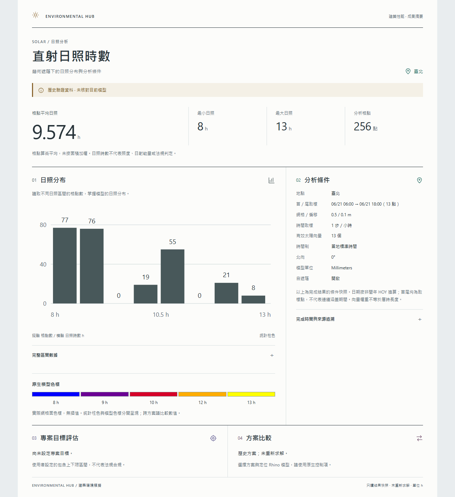

# 0.10.9｜日照成果頁視覺優化

日期：2026-10-05（臺北）。本輪改善現有只讀結果頁與 HTML 匯出；沒有改動 Core、Adapters、Grasshopper、求解或 Rhino 視埠預覽。

## Audit 與實作

| 現況問題 | 修改後的閱讀方式 |
| --- | --- |
| 標題、統計與每個章節層級相近 | 建築成果報告式標頭、大型平均日照、次要最小／最大／格點數 |
| 寬版仍是長條堆疊 | 分布圖／原生色樣與必要條件並列；窄版依順序垂直閱讀 |
| 表格與長識別摘要佔據主畫面 | 原生 HTML details 展開完整數據與來源，所有內容仍保留 |
| 縱軸與柱值難快速判讀 | 整數格點刻度、每柱實際數量、完整區間表與格點占比 |
| 320px 圖表字級隨 SVG 縮小 | 窄版放大 SVG 文字；重新檢查淺／深色 |
| 分析日期需從原始請求讀取 | 顯示首／尾取樣與點數，依非閏年 HOY 換算，保留原序列及跨年方向 |

使用開放分欄、細線、留白、中文排版及本地 SVG 線條圖示；狀態為暖褐、條件為綠、專案目標為紫、比較為梅色，文字與章節序號同時表達意義。保留現有主題色規範，不加入漸層、陰影、裝飾動畫或額外卡片。

統計柱色與實際模型色樣獨立。色樣取自原生網格面，不插值、不推定共用色階；格點占比不是面積比例。沒有增加虛構 3D 模型、模擬結果或合規評分。

## 驗證範圍

- 外掛 0.10.9.0 Release Build：0 錯誤／0 警告。版本化輸出 `artifacts/company-build/0.10.9`，未取代公司註冊。
- 18 項呈現契約通過：原生資料分箱／邊界／單值、色樣、無效資料、安全編碼、離線 CSP、精確導航限制、日期跨年／非閏年、文化獨立與原始結果不變。
- Headless Edge 實際 CSS viewport：320、480、760、960、1280px × 淺／深色，共 10 組；收合／展開皆檢查無水平溢出與來源可讀回，保存 20 張畫面。
- 人工檢視最終 10 張收合圖，加 320px 淺色與 1280px 深色展開圖；未見章節、數字、圖例重疊。其餘展開圖有自動尺寸／DOM 檢查，不宣告逐張人工驗收。
- 資料為 `samples/archive_0107/legacy_comparison.json` 的歷史原生結果，256 格點、8–13 h、平均 9.57421875 h；畫面清楚標記歷史資料。本輪沒有新求解。
- 第一輪 Headless Edge 在沙箱內無法產生 DevToolsActivePort；經允許後以專案內獨立 profile 執行成功，只關閉本工具建立的瀏覽器程序。未使用 Computer Use 或一般瀏覽器 profile。

[驗證 receipt](evidence/visual_0109/acceptance.json) · [呈現檢查](evidence/visual_0109/presentation_checks.json) · [瀏覽器尺寸／展開檢查](evidence/visual_0109/browser-verified/verification.json)。

## 預覽

[淺色 HTML](evidence/visual_0109/summary-light.html) · [深色 HTML](evidence/visual_0109/summary-dark.html)。離線、無 JavaScript、無外部字型／圖片／網路請求；可直接展開表格與來源。

## 版本、限制與下一步

正式基準維持 0.9.2／9 獨立、1 後端、112 待接入；候選來源 0.10.9／10、1、111，UI 修改不增加 Ladybug 功能覆蓋。先前 0.10.8 Rhino 探查保留原驗證範圍，不算本輪 0.10.9 原生驗收。

WebView 預設試驗 gate 保留。完整 Rhino Dock 窄寬、原生主題／DPI／焦點／鍵盤、HTML 檔案對話框與非同步失敗復原仍待驗收；本輪瀏覽器檢查不能替代這些門檻。下一步先完成宿主門檻，再將這套閱讀層級逐步用於日射、陰影與風花圖成果；不先改寫全部平台。多功能 MVP 活動順序與預算不變，Eddy3D 引擎／基準探查仍優先。

[目前狀態](PROJECT_STATUS.md) · [活動計畫](MULTI_VISUAL_MVP_PLAN_2026-10-05.md) · [UI 規範](UI_UX_STANDARD.md) · [前輪 WebView 探查](WEBVIEW_RESULT_PROBE_0108.md)。
