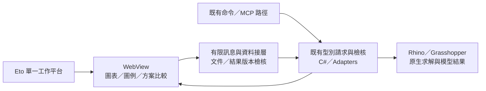

## 2026-10-05 · 0.10.8 日照圖像摘要與 WebView 探查

候選來源 0.10.8 新增中文日照分布圖、原生色樣、KPI／來源／目標／比較摘要與離線 HTML 匯出。只讀 WebView 在同一內部視圖惰性載入，預設由試驗 gate 阻擋初始化；C# 權威狀態與求解核心保留。

最終 Build 0 錯誤／0 警告；呈現契約 16、原有方案契約 42、隔離 Rhino 呈現／狀態 9 項通過，修正版 WebView 中文 DOM 已讀回。真正 320／480 CSS viewport 淺／深色四張已檢視，無水平溢出。這是歷史原生結果的呈現驗證，沒有本輪新求解。

原生 SDK 擷取、完整 Dock／原生深色／DPI／鍵盤／檔案及非同步失敗復原待驗收；MV-U0 部分完成。公司自建 Rhino 自動載入舊 0.10.1，探查改用獨立組件名稱，未替換公司註冊或正式部署。正式仍 0.9.2／9、1、112；候選 10、1、111，UI 工作不增加功能覆蓋。

[詳細驗證與下一步](WEBVIEW_RESULT_PROBE_0108.md) · [證據](evidence/webview_0108/acceptance.json) · [離線摘要](evidence/webview_0108/summary-light.html)。本輪失敗與限制另存；其他專案未修改，GitHub 未推送。

# UI 優化方向｜Eto 外框＋WebView 視覺成果

日期：2026-10-05（臺北）。配合 [多功能視覺 MVP](MULTI_VISUAL_MVP_PLAN_2026-10-05.md)，納入使用者提供的「Rhino MCP UIUX」對話作設計參考。本文件是方案與探查規格，尚未實作 WebView 外掛頁面或完成宿主驗收。

## 1. 參考採用與界線

參考對話 ID：`6ac260c4-bf94-83ec-9d6b-6bed68f3d8c7`；透過 read_thread 讀取可提供的 bounded 內容，最多 20,000 字元，頁面無 older cursor。其技術推薦與案例版本屬參考資料，不當作本專案已驗證能力。

採用：單一持續工作平台、Viewport 與面板回饋、共享設計規則、UI／Command／MCP 重用既有型別請求與 Adapter、Web 頁可獨立檢查排版。既有 UI 含部分操作狀態，先在呈現邊界增設薄接層，按需抽離；不先重寫全部 Core 或建立跨專案通用框架。

不直接採用參考中的框架星等、速度／商業效果、假百分比進度、未驗證取消，以及全部換 Svelte 或大型 UI SDK 的建議。案例 Slate／DKUI 等只作後续研究線索；本輪未逐一核對，不寫成已完成案例研究。使用者既有 Professional／Minimal／Scientific／Architectural 風格優先，保留克制分區，避免過多 Card、陰影、漸層與裝飾動畫。

## 2. 已確認與尚未確認

公司安裝目錄唯讀檢查：`C:/Program Files/Rhino 8/System/Eto.dll` 檔案版本 **2.11.9747.24023**；`Eto.Wpf.dll`、`Microsoft.Web.WebView2.Core.dll`、`Microsoft.Web.WebView2.Wpf.dll` 存在。`Eto.xml` 記錄 `Eto.Forms.WebView`、`LoadHtml`、`DocumentLoaded`、`MessageReceived`，JS 訊息入口為 `window.eto.postMessage(string)`。組件／XML 存在不代表目前宿主已成功初始化 WebView2，不能宣告已可部署。

官方 [Eto WebView 原始碼](https://github.com/picoe/Eto/blob/develop/src/Eto/Forms/Controls/WebView.cs) 與 [WPF WebView2 Handler](https://github.com/picoe/Eto/blob/develop/src/Eto.Wpf/Forms/Controls/WebView2Handler.cs) 支持此技術路徑；develop 分支不等同公司安裝版本，實作須以本機 DLL API 為準。[Rhino Eto 官方指南](https://developer.rhino3d.com/guides/eto/)作宿主整合參考。

待驗證：實際 Handler／runtime、離線初始化、Dock／浮動與外框重建、DPI、深色、中文與鍵盤、檔案／物件選取後焦點、訊息往返與狀態隔離、初始化失敗處理、公司部署。Windows 是當前驗收平台；Eto 抽象不代表本專案已通過 Mac。

## 3. 混合式介面分工

| 層次 | 初期責任 | 交付界線 |
| --- | --- | --- |
| Eto／HubWorkspacePanel | 唯一註冊 Dock、模組導覽、原生選取／檔案對話框、初始化與失敗時替代呈現 | 保留既有命令、文件隔離與快取資料生命週期 |
| Eto.Forms.WebView | 承載本機 HTML／CSS／JS；第一批成果圖表、圖例、比較與條件摘要 | 先只讀，確認收益與宿主穩定後才新增操作訊息 |
| Rhino 視埠 | 真實模型日照／陰影／輻射／風場、定位與預覽開關 | 沿用已驗證預覽路徑；DisplayConduit 如需新增則另驗 owned lifecycle |
| C# 呈現接層 | 提供型別化完成結果與狀態；檢核有限的 UI 動作 | 重用 request → preflight → adapter → result；資料權威仍在 C#，不讓 JS 維護第二套求解狀態 |

## 4. 第一個可評估探查 MV-U0

範圍限定同一工作平台中的「只讀結果／圖表頁」。用真實已完成結果或標示版本與歷史來源的固定驗證資料，展示圖例、單位、條件及一組 A／B 摘要；不造新求解數值。第一步 HTML／CSS／SVG／少量 JS，本機離線資源，不引入 CDN 或外部服務；Svelte＋TypeScript 在探查後按實際組件數／維護需求決定，不先增加完整工具鏈。

驗收順序：SDK 編譯與 API 核對 → 專用隔離 Rhino 的只讀載入 → 窄寬／主題／DPI與中文排版 → 關閉／停靠重建／文件切換 → 初始化失敗及既有 Eto 替代頁。只讀通過後才測 `MessageReceived` 與定位／切換預覽等有限動作。Build、瀏覽器頁、宿主控制項與真實 Dock 分別記錄。

預留 **2–4 人日**，加一次 25% 為 **3–5 人日**；屬條件式探查追加，未含於既有核心 MVP 48–85 或含風場 63–113 人日。若選擇執行 U0，核心加 U0 的原始 40–72 統一乘 1.25 為 **50–90 人日**；含風場加 U0 的原始 52–94 統一乘 1.25 並向上取整為 **65–118 人日**。這不包含全介面遷移；實際遷移依驗證收益另估，不能把 PoC 當已完成 Web UI 交付。

通過才把新圖表頁優先交給 WebView；失敗則保留 Eto 呈現與原始證據，不阻塞多功能 MVP。是否採 WebView，以宿主可靠性、排版／互動收益及部署負擔決定。

## 5. 狀態與訊息規則

- 第一批只傳呈現需要的數值／圖例／來源，完整 NativeResult 保留於 C# 與既有 JSON；模型網格仍在 Rhino，避免每次把大型幾何傳給 Web 頁。
- 動作包含 schema version、request ID、文件識別與結果 revision；C# 檢查 active document、完成結果、busy／stale 狀態，只允許列出的動作。拒絕過期文件／結果的命令。
- 模型操作與求解經既有宿主路徑與執行緒規則；WebView 不使 GH 自動變成背景工作，不能直接 Task.Run 原生求解。
- JS／C# 訊息採結構化 JSON，不以字串插入來自結果／檔案的可執行程式；不暴露任意 Python、C#、Rhino command 或任意檔案讀寫。只載入打包資源並限制導覽／新視窗。
- Web 頁崩潰、初始化失敗或重載不刪除既有結果與方案；不把權威状態保存在瀏覽器儲存。3dm 持久化是另一工作包，不因參考對話有此例子就宣告已有。

## 6. 視覺與操作規格

從 HubVisuals／HubUi／UI_UX_STANDARD 映射 CSS tokens，保留主題色與資訊層級，確認 pt／px／DPI 換算，不複製未驗證像素常數。圖例數值、單位與色樣來自實際結果；圖表資訊不得只靠 hover，鍵盤及匯出也要能讀取。

工作平台以六階段為主線，能力切換與共用條件保持簡單；Rhino 模型為主要空間成果區，Web 頁負責時間圖、風花圖、比較與說明。先加入選取數／來源回饋、定位與清楚狀態，再評估拖拉控制。操作不產生新求解時只更新呈現，真正改條件才標示需重算。

## 7. 本輪交付

完成參考對話讀取、官方 API 查核、公司 SDK 靜態盤點、混合式分工與 U0 出口規格。本輪沒有啟動 Rhino、安裝前端套件、替換外掛或新增 WebView 頁；正式／候選版本與驗收數不變。此規格與新 MVP 活動計畫一同同步既有 Notion PLAN-VISUAL-001、重點與固定 KB-003。
