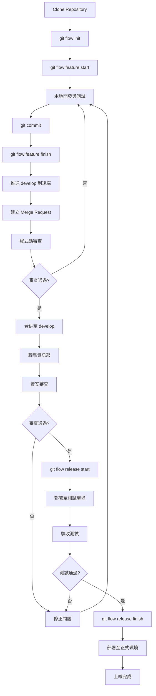
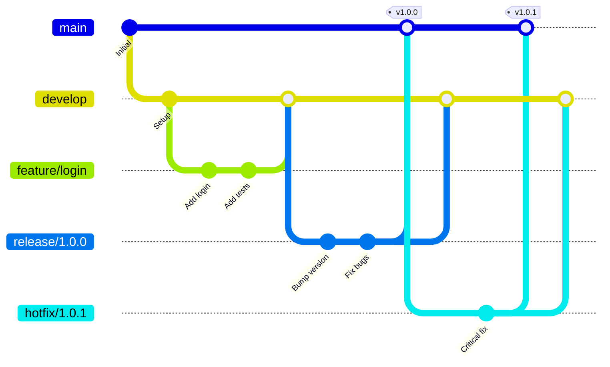

# CoDev Studio

<div align="center">


**中興工程協作開發平台**

*Co-Development · Code Vibe · AI-Powered Innovation*

</div>

---

## 📖 關於 CoDev Studio

CoDev Studio 是中興工程顧問股份有限公司專為全體同仁打造的協作開發平台。平台名稱蘊含多重意義:

- **Co-Development** - 協作開發，促進團隊合作
- **Code Vibe** - 程式碼的節奏與氛圍，創造良好的開發體驗
- **AI Copilot** - 整合 AI 輔助工具，提升開發效率

我們致力於打造一個安全、高效、創新的開發環境，讓每位同仁都能發揮創意，共同推動公司的數位轉型。

---

## ✨ 平台特色

### 👥 協作開發
- 統一的程式碼儲存庫管理
- 版本控制與分支管理
- 程式碼審查（Code Review）機制
- 知識分享與技術交流平台

### 🔒 資安審查
- 研發及資訊部提供專業資安審查服務
- 自動化安全掃描工具
- 符合公司資安政策與規範
- 定期安全更新與漏洞修補

### 🚀 上線支援
- 通過審查後協助部署至正式環境
- CI/CD 部署流程
- 監控與維護支援
- 技術諮詢與問題排解

---

## 🛠️ 技術架構

### 支援的開發語言與框架
- **底層**: Python 3.12
- **全端**: Django 5.2

### 開發工具整合
- Git 版本控制
- SonarQube 程式碼品質分析

---

## 🚀 快速開始

### 1️⃣ Clone Repository

```bash
# 使用 HTTPS
git clone https://50-129.sinotech.com.tw:6981/public/CoDevStudio.git

# 或使用 SSH
git clone git@50-129.sinotech.com.tw:6981:public/CoDevStudio.git

# 進入專案目錄
cd CoDevStudio
```

### 2️⃣ 設定開發環境

```bash
# 建立venv
py -m venv venv
venv\Scripts\activate
# 安裝套件
pip install -r requirements.txt

```

### 3️⃣ 開始開發

```bash
# 啟動開發伺服器
python manage.py runserver
```

### 4️⃣ 使用 Git Flow 建立分支

我們採用 **Git Flow** 工作流程來管理程式碼版本：

```bash
# 初始化 Git Flow（首次使用）
git flow init

# 開始新功能開發
git flow feature start your-feature-name

# 進行開發...

# 提交變更
git add .
git commit -m "feat: add your feature description"

# 完成功能開發（會自動合併到 develop 並刪除 feature 分支）
git flow feature finish your-feature-name

# 推送 develop 分支到遠端
git push origin develop
```

**Git Flow 分支說明：**
- `main` - 正式環境程式碼，只接受來自 release 或 hotfix 的合併
- `develop` - 開發環境程式碼，整合所有功能分支
- `feature/*` - 功能開發分支，從 develop 分出
- `release/*` - 發布準備分支，從 develop 分出
- `hotfix/*` - 緊急修復分支，從 main 分出

---

## 📋 開發流程

### Git Flow 完整開發週期



### 詳細步驟說明

#### 階段一：開發階段（使用 Git Flow）
1. **Clone Repository** - 從 CoDev Studio 複製專案
2. **初始化 Git Flow** - 執行 `git flow init -d` 設定分支結構
3. **開始功能開發** - 使用 `git flow feature start <name>` 建立功能分支
4. **本地開發** - 使用 AI 工具輔助開發
5. **單元測試** - 撰寫並執行測試確保程式碼品質
6. **完成功能** - 使用 `git flow feature finish <name>` 合併回 develop

#### 階段二：審查階段
7. **建立 Merge Request** - 在 GitLab 上建立 MR 從 develop 到 main
8. **程式碼審查** - 團隊成員進行 Code Review
9. **修正建議** - 根據審查意見調整程式碼
10. **合併至 develop** - 審查通過後合併

#### 階段三：資安審查階段
11. **聯繫資訊部** - 寄信通知資安審查 (rexshiu@mail.sinotech.com.tw)
12. **資安掃描** - 自動化工具進行安全性檢測
13. **人工審查** - 資安專家進行深度審查
14. **修正漏洞** - 根據審查報告修正安全問題

#### 階段四：發布階段（使用 Git Flow Release）
15. **建立 Release** - 使用 `git flow release start <version>` 建立發布分支
16. **測試環境部署** - 部署至測試環境進行驗證
17. **整合測試** - 執行完整的系統測試
18. **完成 Release** - 使用 `git flow release finish <version>` 合併到 main 和 develop
19. **正式環境部署** - 部署至正式環境
20. **監控與維護** - 持續監控系統運作狀態

#### 緊急修復（使用 Git Flow Hotfix）
當正式環境發現緊急問題時：
1. **建立 Hotfix** - `git flow hotfix start <version>`
2. **修復問題** - 快速修復並測試
3. **完成 Hotfix** - `git flow hotfix finish <version>` 同時合併到 main 和 develop
4. **緊急部署** - 立即部署到正式環境

---

## 🌿 Git Flow 工作流程

### 分支策略



### Git Flow 指令速查

#### 功能開發
```bash
# 開始新功能
git flow feature start <feature-name>

# 發布功能（合併到 develop）
git flow feature finish <feature-name>

# 推送功能分支到遠端（協作開發）
git flow feature publish <feature-name>

# 拉取其他人的功能分支
git flow feature pull origin <feature-name>
```

#### 版本發布
```bash
# 開始發布準備
git flow release start <version>

# 完成發布（合併到 main 和 develop，建立 tag）
git flow release finish <version>

# 推送所有變更和標籤
git push origin main develop --tags
```

#### 緊急修復
```bash
# 開始緊急修復
git flow hotfix start <version>

# 完成緊急修復（合併到 main 和 develop）
git flow hotfix finish <version>

# 推送所有變更和標籤
git push origin main develop --tags
```

---

## 📝 提交規範

### Commit Message 格式

我們採用 [Conventional Commits](https://www.conventionalcommits.org/) 規範：

```
<type>(<scope>): <subject>

<body>

<footer>
```

### Type 類型

- `feat`: 新功能
- `fix`: 錯誤修復
- `docs`: 文件更新
- `style`: 程式碼格式調整（不影響功能）
- `refactor`: 重構（既非新增功能也非修復錯誤）
- `perf`: 效能優化
- `test`: 測試相關
- `chore`: 建置流程或輔助工具變動

### 範例

```bash
feat(auth): add user login functionality

- Implement JWT authentication
- Add login API endpoint
- Create login form component

Closes #123
```

### 審查項目

- ✅ 程式碼安全性檢查
- ✅ 相依套件漏洞掃描
- ✅ 資料加密與傳輸安全
- ✅ 身份驗證與授權機制
- ✅ 輸入驗證與防範注入攻擊
- ✅ 敏感資料保護
- ✅ 日誌記錄與監控
- ✅ 錯誤處理與異常管理

### 審查時程

- **一般專案**: 5-7 個工作天
- **緊急專案**: 2-3 個工作天（需主管核准）
- **大型專案**: 10-14 個工作天

---

## 📚 開發指南

### 程式碼風格

- 遵循各語言的官方風格指南
- 使用 Linter 工具自動檢查
- 保持程式碼簡潔易讀
- 適當的註解與文件

### 測試要求

- 單元測試覆蓋率 > 80%
- 關鍵功能必須有整合測試
- 提交前執行所有測試
- 新功能必須包含測試

### 文件撰寫

- README.md 說明專案概述
- API 文件使用 Swagger/OpenAPI
- 重要功能需有使用說明
- 更新 CHANGELOG.md

---

## 🤝 貢獻指南

我們歡迎所有同仁參與 CoDev Studio 的建設！我們使用自建的 Gitea 伺服器進行協作。

### 1️⃣ 註冊帳號

請前往我們的 Gitea 伺服器註冊帳號：
[https://50-129.sinotech.com.tw:6981/](https://50-129.sinotech.com.tw:6981/)

### 2️⃣ Fork 專案

1. 登入 Gitea。
2. 前往 [CoDev Studio 專案頁面](https://50-129.sinotech.com.tw:6981/public/CoDevStudio)。
3. 點擊右上角的 **Fork** 按鈕，將專案複製到您的個人帳號下。

### 3️⃣ Clone 您的 Fork

```bash
# 將 <username> 替換為您的 Gitea 帳號
git clone https://50-129.sinotech.com.tw:6981/<username>/CoDevStudio.git
cd CoDevStudio
```

### 4️⃣ 設定 Upstream (保持同步)

為了讓您的 Fork 能跟上主專案的更新，請設定 upstream：

```bash
git remote add upstream https://50-129.sinotech.com.tw:6981/public/CoDevStudio.git
```

當主專案有更新時，您可以這樣同步：

```bash
git fetch upstream
git checkout develop
git merge upstream/develop
```

### 5️⃣ 開發流程 (Git Flow)

我們嚴格遵守 Git Flow 流程：

1. **建立功能分支**：
   ```bash
   git flow feature start my-awesome-feature
   ```
2. **進行開發與提交**：
   ```bash
   git add .
   git commit -m "feat: add amazing feature"
   ```
3. **完成功能 (僅限本地)**：
   如果您想保留分支以便發送 Pull Request，**請不要**直接使用 `git flow feature finish`，而是直接推送分支：
   ```bash
   git push origin feature/my-awesome-feature
   ```
   *(或者，如果您已經 finish 了，請確保推送到您的 fork 的 develop 分支)*

### 6️⃣ 提交 Pull Request (PR)

1. 回到 Gitea 您的專案頁面。
2. 切換到您剛推送的分支 (例如 `feature/my-awesome-feature`)。
3. 點擊 **New Pull Request** (或 **New Merge Request**)。
4. 確保目標是 `public/CoDevStudio` 的 `develop` 分支。
5. 填寫標題與說明，描述您的變更。
6. 點擊 **Create Pull Request**。

等待團隊成員進行 Code Review，通過後將會合併至主專案。

---

## 📞 聯絡資訊

### 技術支援

- **Email**: rexshiu@mail.sinotech.com.tw
- **分機**: 06843, 07502, 07361

### 資安審查

- **Email**: rexshiu@mail.sinotech.com.tw
- **負責單位**: 研發及資訊部
- **分機**: 06843

### 上線支援

- **Email**: rexshiu@mail.sinotech.com.tw
- **負責單位**: 研發及資訊部
- **分機**: 06843

---

## 📄 授權說明

本專案為中興工程顧問股份有限公司內部使用，所有程式碼與文件受公司內部規範約束。

**重要提醒**:
- 禁止將程式碼上傳至公開平台
- 敏感資訊不得外洩
- 遵守公司資安政策
- 尊重智慧財產權


---

## 🙏 致謝

感謝所有參與 CoDev Studio 建設的同仁，你們的貢獻讓這個平台更加完善！

特別感謝：
- 研發及資訊部團隊
- 所有早期使用者與回饋者
- 提供技術支援的各部門同仁

---

<div align="center">

**讓我們一起打造更好的開發體驗！**

Made by 中興工程研發及資訊部

</div>
